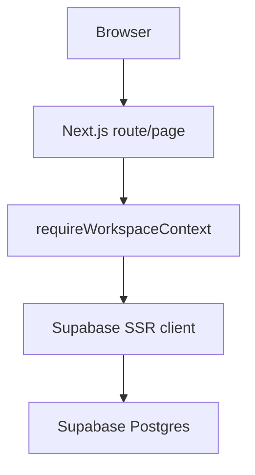
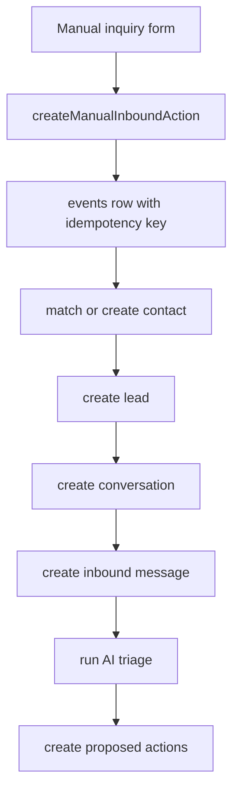
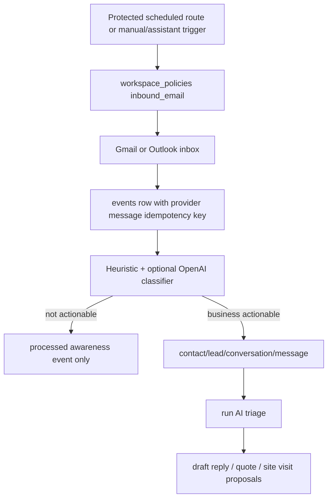
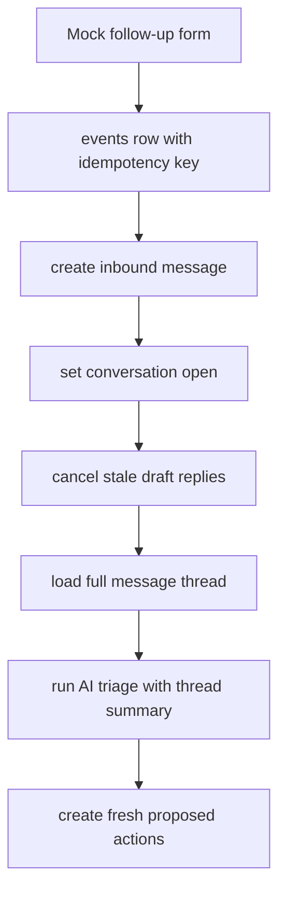

# Current Architecture

This document is the practical handoff guide for humans and AI agents working on Kyro.
It explains how the current code is structured, where data flows, and which pieces are
real versus intentionally stubbed.

## Project Shape

Kyro is a TypeScript monorepo.

- `apps/web`: Next.js App Router web app.
- `packages/db`: Drizzle schema and migration source.
- `packages/api`: backend domain helpers for actions, events, bootstrap, usage, and policies.
- `packages/ai`: model routing helper.
- `packages/contracts`: shared TypeScript/Zod contracts.
- `packages/core`: product constants.
- `packages/jobs`: workflow placeholder package.
- `supabase/migrations`: generated SQL migrations applied to Supabase.
- `docs`: product, architecture, database, and backlog notes.
- `docs/assistant-help-manual.md`: user-facing help source the Assistant can answer from.
- `docs/deployment-checklist.md`: production/env verification checklist for the current stack.

## Runtime Stack

- Next.js App Router renders the web app.
- Supabase Auth handles sessions.
- Supabase Postgres is the source of truth.
- Drizzle owns schema/migration generation.
- Server Components read workspace data.
- Server Actions mutate data and then revalidate/redirect.
- Client Components are used only where local UI state improves UX, such as instant contact filters.

## Request Flow

The current web request pattern is:



Most routes call `requireWorkspaceContext()` before loading tenant data. This enforces:

- user must be signed in,
- user must have a bootstrapped workspace,
- all page data is loaded through the authenticated Supabase session.

Key file: `apps/web/src/lib/workspace/context.ts`.

## Data Ownership

All business data is workspace-scoped. The important tables are:

- `contacts`: CRM profiles.
- `leads`: sales/service opportunities attached to contacts.
- `channels`: communication source definitions.
- `workspace_phone_numbers`: Twilio phone/SMS numbers, capability metadata,
  provider ids, per-number Vapi mapping metadata, and pass-through rental cost
  snapshots. Assigned rows have `workspace_id` and `status = active`; beta pool
  rows keep `workspace_id = null` and `status = available` until the server-side
  pool helper assigns one to a workspace.
- `integration_connections`: connected provider accounts such as Google Workspace,
  with encrypted token payloads and provider account metadata.
- `integration_oauth_states`: short-lived OAuth state and PKCE verifier records for
  provider connect flows.
- `conversations`: message threads.
- `messages`: inbound/outbound communication records.
- `files`: private file metadata for uploaded/generated/stored files, including inbound email attachments, assistant uploads, generated images, generated document PDFs, and outbound retry attachments stored in Supabase Storage.
- `generated_documents`: first-class quote/invoice PDF records linked to contacts, leads, conversations, quote drafts, storage files, outbound messages, and optional Google Drive file ids.
- `voice_calls`: Vapi/Twilio phone-call ledger rows for inbound customer calls, voicemail overflow, user-to-Kyro calls, and outbound customer calls.
- `voice_call_events`: raw Vapi webhook/tool-call events linked to the durable call row.
- `inquiry_facts`: current editable inquiry facts for a conversation, separate from raw AI output.
- `events`: idempotent ingestion and workflow events.
- `actions`: proposed or executable work, including AI-proposed replies.
- `conversation_tasks`: durable internal tasks linked to a conversation and optionally a message/action.
- `conversation_appointments`: durable appointment/site-visit records linked to a conversation, task, and optional action.
- `conversation_notes`: internal-only notes linked to a conversation and optionally a specific message.
- `outbound_messages`: durable outbound delivery queue/ledger for user and
  action-triggered sends, including idempotency keys, attempt counts, retry
  scheduling, provider metadata, and last-error state.
- `quote_drafts`: internal quote document placeholders created from approved actions.
- `assistant_threads`: persistent Assistant conversations per workspace/user.
- `assistant_messages`: saved Assistant/user turns, tool-call records, and UI block records.
- `assistant_memories`: active long-term Assistant memories plus pending/rejected
  suggested memories for user approval.
- `assistant_context_snapshots`: compacted daily/weekly/monthly Assistant context
  snapshots that let the single persistent chat stay responsive without losing
  searchable long-term history. Snapshot reads and compaction are best-effort:
  if the table is unavailable or Supabase has a stale schema cache, the Assistant
  continues from raw messages, memories, and the thread summary rather than
  failing the user's turn.
- `assistant_prompt_suggestion_sets`: per-workspace/user suggestion-pill sets
  generated from recent first-of-day/session Assistant prompts. The Assistant
  shows a rotating subset while the full stored set is available through
  `/api/assistant/suggestions` for the web and mobile apps.
- `ai_runs`: AI workflow records.
- `model_route_decisions`: model selection audit trail.
- `usage_events`: metered provider/API usage.
- `kyro_billing_periods`: Kyro-owned monthly billing periods generated from
  usage and plan settings.
- `kyro_invoices`: Kyro invoices for charging workspace owners through saved
  Stripe customer/payment-method records.
- `kyro_invoice_line_items`: invoice detail rows for base subscription, usage,
  tax, and future adjustments.
- `workspace_policies`: JSON policy store for workspace-level settings such as
  `workspace_general`, communication/outbound preferences, inbound email,
  voice, document templates, and budgets. `workspace_general` now includes the
  editable business profile used by Settings, reports, assistant context, and
  future customer-facing documents.
- `audit_logs`: append-only history of meaningful changes.

Schema source: `packages/db/src/schema.ts`.
Applied migrations: `supabase/migrations`.

## Auth And Workspace Bootstrap

Auth screens live in:

- `apps/web/src/app/sign-in/page.tsx`
- `apps/web/src/app/create-account/page.tsx`
- `apps/web/src/app/auth/actions.ts`
- `apps/web/src/app/auth/callback/route.ts`

Workspace creation lives in:

- `apps/web/src/app/create-account/page.tsx`
- `apps/web/src/app/onboarding/page.tsx`
- `apps/web/src/app/onboarding/actions.ts`
- `apps/web/src/lib/workspace/bootstrap.ts`

Create-account is now a three-step onboarding flow: owner login/contact details,
business basics including operating country/location/service area, and inline
Stripe payment-method setup for the two-week trial. The workspace can be created
between the business-basics and payment steps so Stripe can attach the saved
payment method to a real workspace/customer record. If Supabase requires email
confirmation before an active session exists, Kyro stores the pending setup
values in Supabase user metadata and `auth/callback` creates the workspace after
the session is exchanged. The older onboarding page remains as a fallback for
signed-in users with no workspace.

On account/workspace bootstrap, Kyro creates:

- user profile,
- workspace,
- owner membership,
- business profile,
- default policies,
- entitlements,
- budget,
- pricing rules.

## App Shell And Navigation

The shared logged-in shell is:

- `apps/web/src/app/components/app-frame.tsx`

Shared visual helpers:

- `apps/web/src/app/components/brand-mark.tsx`
- `apps/web/src/app/components/page-skeleton.tsx`
- `apps/web/src/app/components/route-preloader.tsx`
- `apps/web/src/app/components/smart-prefetch-link.tsx`

The shell also mounts a small client-side route preloader. After the browser is idle,
it staggers prefetches for the day-to-day operational routes only, so Dashboard,
Assistant, Inbox, CRM, Files, and Activity feel warmer without preloading every
heavy or low-frequency surface. Nav links still leave automatic Next prefetching
off, but `SmartPrefetchLink` prefetches on user intent (`hover`, keyboard focus,
or mobile touch) so deliberate navigation to Settings, Reports, Developer tools,
voice, or detail pages still feels immediate without loading the whole app up front.

The floating Assistant launcher is intentionally lightweight in the shared shell.
It renders a small welcome state and only creates/loads the real persisted Assistant
thread when the user sends a message or opens the full Assistant tab. This avoids
making every logged-in route pay for assistant-thread history queries just because
the launcher is visible.

First-run product guidance is handled by a lightweight tutorial overlay on the
dashboard. Completion is stored against the workspace/user so it only appears once
for normal users, while developer accounts can replay or reset the tutorial from
the app UI during product testing.

On narrow mobile viewports, the shell hides the desktop sidebar, exposes the full
navigation through a drawer menu, and pins a bottom quick-nav for Assistant, Voice,
Inbox, and Settings. Inbox and Voice metrics become horizontal, touch-friendly
summary strips instead of squeezed desktop cards, so the emergency web UI maps
more naturally to future iOS tabs.

Mobile detail surfaces intentionally do not use the desktop split-view pattern.
Assistant previews, Inbox message previews, selected CRM profiles, and Settings
detail screens become fixed full-screen task panels with their own scroll area
and a close/back action, similar to opening an email thread or Settings detail in
a mobile app. Desktop keeps the side-by-side split views.

The app shell currently exposes:

- Dashboard: `/dashboard`
- Assistant: `/assistant`
- Vapi Voice: `/voice-vapi`
- Inbox: `/inbox`
- CRM: `/contacts`
- Files: `/files`
- Activity: `/activity`
- Reports: `/reports`
- Developer: `/developer`
- Settings: `/settings`

Legacy convenience routes:

- `/leads` redirects to `/contacts`.
- `/documents` and its child quote/template routes re-export the Files/quote
  implementation for compatibility with older links.
- `/usage` redirects to `/settings#usage`.

## Assistant Prompt Suggestions

Assistant suggestion pills are no longer hard-coded as the only source of truth.
The web page loads the latest active `assistant_prompt_suggestion_sets` row for
the current workspace/user, rotates four visible suggestions from the stored
list, and falls back to safe defaults if the table is missing or empty.

Generation lives in `apps/web/src/lib/assistant/prompt-suggestions.ts`.
The generator looks at the first few user prompts per Assistant thread/day from
the previous week, removes attachment context, rejects customer-specific details
such as names, emails, phone numbers, addresses, and file ids, then asks OpenAI
for a reusable list when available. If OpenAI is unavailable, deterministic
fallback scoring still produces a useful customer-agnostic list.

APIs:

- `GET /api/assistant/suggestions`: returns the current visible/stored
  suggestion set. It accepts normal web cookies or a Supabase bearer token for
  mobile clients.
- `POST /api/assistant/suggestions`: manually refreshes the current user's
  suggestion set.
- `GET|POST /api/assistant/suggestions/refresh`: scheduled refresh endpoint
  protected by `ASSISTANT_SUGGESTION_REFRESH_SECRET` or `CRON_SECRET`.

`vercel.json` schedules the refresh weekly. The route uses the service role to
walk workspace members, but each generated set remains tied to a specific
workspace and user.

## Current Screens

### Dashboard

File: `apps/web/src/app/dashboard/page.tsx`

Purpose:

- act as the main command-centre view for daily operations,
- show configurable KPI cards such as needs reply, ready to quote, approved/booked work, and follow-up due,
- show swappable middle and bottom widgets such as work queue, mini Assistant, system activity, payments, top contacts, suppliers, document activity, Vapi voice, and calendar placeholder widgets,
- keep the mini Assistant usable without leaving the dashboard,
- expose timeframe controls and dashboard customisation without making the layout scroll-heavy.

The old chronological log view has moved to Activity. Dashboard is now the operational
overview for what the user should look at first.

### Reports

Files:

- `apps/web/src/app/reports/page.tsx`
- `apps/web/src/app/reports/print/route.ts`
- `apps/web/src/app/reports/pdf/route.ts`
- `apps/web/src/lib/reports/data.ts`
- `apps/web/src/lib/reports/render.ts`

Purpose:

- generate exportable workspace reports from current Kyro data,
- support report types for all communications, inbound communications, outbound communications, communications by contact, usage ledger, document activity, work queue summary, and placeholder payment history,
- filter reports by timeframe, custom date range, contact, direction, and channel where that filter applies,
- keep `/reports` light until the user explicitly clicks Generate report,
- render the browser print preview and server-generated PDF download only after generation using one compact standard report template,
- keep report output space-efficient with a slim header, compact metadata/stat rows, and consistent table columns rather than large decorative card blocks,
- place the dedicated business/workspace logo in report output when one exists, otherwise fall back to the business name in black without Kyro branding. Reports deliberately do not reuse outbound email-signature logos, because those may be Kyro-branded signature assets.
- avoid printing internal row-limit/disclaimer copy in the report output; if report limits need to be explained, keep that guidance in the Reports UI.

Payment history reports intentionally remain empty until customer payment collection
records exist. Add future report types in `apps/web/src/lib/reports/data.ts`, then reuse
the existing print/PDF renderer unless the report truly needs a custom format.

### Developer

Files:

- `apps/web/src/app/developer/page.tsx`
- `apps/web/src/app/developer/outbox/page.tsx`
- `apps/web/src/app/developer/outbox/actions.ts`
- `apps/web/src/app/developer/assistant-tools/page.tsx`
- `apps/web/src/app/developer/system-health/page.tsx`
- `apps/web/src/app/developer/smoke-tests/page.tsx`
- `apps/web/src/lib/assistant/tool-registry.ts`
- `apps/web/src/lib/developer/system-health.ts`

Purpose:

- hold internal test tools away from the main product surfaces,
- expose the mock inbound inquiry form for local testing,
- submit through the same `createManualInboundAction` and `ingestManualInbound` flow
  used by previous dashboard/manual testing,
- redirect back to `/developer` with success/error messages after ingestion,
- expose an internal outbox operations surface at `/developer/outbox` for queued,
  retry-scheduled, failed, sent, and dismissed outbound delivery rows,
- let an operator retry queued/scheduled/failed outbox rows or dismiss dead test
  rows without deleting audit history,
- expose an Assistant tool registry at `/developer/assistant-tools` so production
  tools, permission gates, provider status, and renderable UI blocks can be
  reviewed in one place,
- expose a read-only System Health screen at `/developer/system-health` for
  environment presence, Supabase table API availability, private storage bucket
  readiness, connected-account scope readiness, cron/worker readiness, provider
  configuration, and recent failed operational rows,
- expose a Smoke Test Checklist at `/developer/smoke-tests` that turns those
  readiness checks into a manual runbook for mock inbound, reply sending,
  generated documents, outbox inspection, inbound sync, and log/audit visibility.

The Developer page is not intended as an end-user surface. It is a convenient place
to keep test controls while Gmail, Drive, SMS, and other integrations are being wired.
Developer health checks deliberately report whether required configuration exists
without printing secret values, and the smoke-test checklist does not create test
records by itself.

### Inbox

Files:

- `apps/web/src/app/inbox/page.tsx`
- `apps/web/src/app/inbox/[conversationId]/page.tsx`
- `apps/web/src/app/inbox/actions.ts`
- `apps/web/src/app/inbox/message-workflow-controls.tsx`
- `apps/web/src/app/inbox/conversation-workflow-panel.tsx`

Purpose:

- list conversations,
- show profile-review warnings,
- open an inquiry review page,
- act as the main work queue for what needs attention next.

The inbox work queue derives buckets from conversation status, saved inquiry facts,
action status, and quote draft presence. Current buckets include needs reply,
missing info, ready to quote, site visit needed, awaiting customer, resolved,
needs review, and needs approval. The page also supports server-side search and
sorting without adding a separate search service.

Performance notes:

- the app shell uses `RoutePreloader` to idle-prefetch the main tabs with a short stagger,
- the persistent global search bar calls `/api/search`, which fans out across the main workspace tables, ranks exact/contact-like matches ahead of lower-value logs, and keeps a small bounded client cache so repeat searches feel immediate,
- high-traffic CRM and Inbox rows use `SmartPrefetchLink`, so detail/split-pane
  payloads warm on hover, keyboard focus, or mobile touch instead of eagerly
  pre-rendering every row,
- lower-frequency long lists still disable automatic prefetching so the app does
  not fetch dozens of detail pages the user is unlikely to open,
- list/review queries are bounded so mock data growth does not silently make every
  tab click heavier,
- inbox split-view loads the conversation list, selected preview, and communication
  settings in parallel once workspace context is resolved,
- Settings renders its menu without fetching every detail panel; each selected
  section loads only its own server data, and the full usage ledger is loaded only
  for `?section=usage`,
- route loading skeletons exist for the log, inbox, inquiry review, CRM, contact
  profile, Files/legacy Documents, quote draft profile, assistant, OpenAI Voice,
  Vapi Voice, usage redirect, and settings pages,
- the development LLM status pill caches its local Ollama health check briefly and is
  rendered behind a Suspense boundary so page content is not blocked by a local model probe.

The inquiry review page shows:

- compact contact profile summary,
- compact lead status,
- AI-extracted inquiry facts such as job type, address, preferred time, urgency, budget, lead suitability, and missing fields,
- editable current inquiry facts that can be corrected by the user,
- a regenerate control that uses the saved corrected facts as the authoritative source for a fresh AI plan,
- a collapsed AI transparency trace showing model, fallback, token usage, proposed action types, and raw debug JSON,
- message thread,
- text channel labels on message rows,
- per-message controls to assign a task, mark the message resolved, and add an internal note,
- durable task and appointment panels for internal follow-up/site-visit work,
- outbound composer for email, SMS, phone, or manual notes,
- reusable AI reply prompt for manual outbound composers; generated drafts also use the saved workspace writing style for tone, wording, length, sign-off, trade phrasing, and reusable instructions,
- outbound metadata including channel type, dry-run/external-send state, provider message id, provider request id, local attachment summaries, quote draft attachment references, and the linked outbox delivery id,
- outbound delivery state showing queued/sending/sent/failed/retry-scheduled attempts with retry controls for failures,
- automatic internal customer follow-up reminders after outbound replies, driven by workspace communication settings,
- mock follow-up inbound message form,
- draft reply work surface,
- action-specific proposal cards for missing info, site visits, quote drafts, and not-fit decisions,
- saved quote draft placeholders when a quote draft action has been executed,
- latest AI triage summary,
- workflow timeline,
- editable draft replies before approval,
- proposed actions and approval/execution controls,
- conversation status controls,
- usage events collapsed by default,
- audit history collapsed by default.

Outbound email can send through the connected Gmail or Outlook account. The shared
mail abstraction selects the latest connected Google or Microsoft provider, and the
outbound layer writes a durable `outbound_messages` row before any provider call.
That row stores the recipient, subject/body, private file references for retryable
attachments, idempotency key, attempt count, retry schedule, provider
message/request ids, and last error. User-written manual replies are treated as already approved because the
user typed the body and pressed send; email sends immediately through the connected
email provider when a contact email exists, but the send is still traceable and
retryable through the outbox ledger. AI-generated/action-queue replies still go
through the action engine and approval/execution controls. SMS can send through
Twilio when the workspace has an active SMS-capable number or testing sender
configured; phone and manual channels remain internal records. Email sends can
include local file uploads from the composer and a server-generated PDF
attachment for a selected quote draft. Generated quote PDFs are created on demand
from structured quote data; before delivery, attachment bytes are uploaded into
the private Supabase Storage bucket (`KYRO_FILE_STORAGE_BUCKET`, default
`kyro-files`) and the outbox keeps `files` metadata references rather than binary
payloads in Postgres. This same outbox path is also used for replies to
filtered-out/skipped email events, which record an `outbound.filtered_email.reply_sent`
event after provider acceptance instead of bypassing the delivery ledger.
Scheduled outbox retry processing lives at `/api/outbox/process`, protected by
`OUTBOUND_DELIVERY_SECRET`, `INBOUND_EMAIL_SYNC_SECRET`, or `CRON_SECRET`.
`vercel.json` schedules it every five minutes. Failed provider sends move to
`retry_scheduled` until attempts are exhausted; the Inbox preview also exposes
manual retry for failed or scheduled delivery rows. Developer -> Outbox operations
is the cross-conversation operational view for the same ledger: it shows
active/sent/dismissed delivery rows, provider ids, attachment summaries, last
errors, reconnect guidance, manual retry, and an operations-only `dismissed`
state for clearing stale test failures without deleting records.
Email signatures are Kyro-managed per workspace: one default signature for manual or
user-edited sends, plus an optional assistant signature for untouched AI-generated
replies. Signature settings live inside the `communication_outbound` policy, support
text plus a small inline logo, and are applied during outbound execution rather than
relying on the user's native email signature.
Outbound writing style is also Kyro-managed per workspace in the
`communication_outbound` policy. The Settings -> Connected accounts -> Outbound
communication panel has a prompt editor for tone, wording style, message length,
sign-off instructions, trade-specific phrasing, and reusable reply instructions.
The on-demand inbox reply generator and inbound triage draft path both inject
these saved settings into the LLM prompt before creating customer-facing email/SMS
drafts.
Real Gmail/Outlook sends also write zero-cost `usage_events` rows so the billing endpoint can
count outbound email volume before paid pricing is decided. Real Twilio SMS sends
write `outbound_sms` usage rows with provider cost/customer-charge snapshots based
on Twilio-returned price when available or the configured local SMS unit-cost
fallback.

Inbound SMS has a first Twilio webhook foundation. `POST /api/integrations/twilio/sms`
validates the Twilio signature, matches the destination number against
`workspace_phone_numbers`, records or reuses a Twilio SMS channel, ingests the SMS
through the same workspace-scoped contact/lead/conversation/message/AI-triage path
as manual inbound, and records inbound SMS usage. The status callback route at
`/api/integrations/twilio/status` updates matching outbox rows with Twilio delivery
state. Number search/purchase and richer staff/operator SMS-command routing are
still future hardening items.

When the app is hosted at `https://kyroassistant.com`, Twilio should use:
`https://kyroassistant.com/api/integrations/twilio/sms` for inbound SMS and
`https://kyroassistant.com/api/integrations/twilio/status` for delivery status
callbacks. Both routes also expose safe `GET` readiness responses so production
configuration can be checked without sending a real SMS or exposing secrets.

Voice calls now have a Vapi/Twilio foundation. Twilio remains the phone-number and
carrier layer; Vapi runs the live voice assistant. `POST
/api/integrations/vapi/webhook` accepts call lifecycle events and records or
updates `voice_calls`; `POST /api/integrations/vapi/tool` accepts approved Vapi
tool calls such as contact lookup, assistant command/context lookup, web search,
recent email sync, contact profile updates, and call-note recording; `GET
/api/assistant/activity` returns the same compact Kyro activity rows used by the
web assistant pane; `GET /api/voice/calls/[callId]` returns the same preview
payload used by the web assistant and mobile app; and `POST /api/voice/outbound`
queues a workspace-scoped outbound customer call through the configured Vapi
outbound assistant. `GET|POST /api/voice/recordings/cleanup` runs as a daily
Vercel cron, deletes expired Vapi call data after 30 days, clears Kyro's
recording URL only after provider deletion succeeds, and keeps transcript,
summary, and audit rows for complaint review. Outbound calls can route across
multiple workspace-owned
numbers: Kyro prefers an active voice-capable `workspace_phone_numbers` row whose
country matches the customer destination number, uses that row's
`metadata.vapiPhoneNumberId`, falls back to the first active mapped voice number,
and only then uses the Settings/env fallback Vapi phone-number id. The
Assistant's Kyro activity pane now includes phone activity and opens a detail
preview with call status, purpose, contact/conversation links, transcript,
summary, recording URL or deletion date, and raw event history. Settings -> Voice stores Vapi
assistant ids, the fallback Vapi phone-number id, user/team numbers, the shared
ElevenLabs/Vapi voice preset, and broad call style preferences that can be passed
into Vapi assistant prompts.

Post-call phone automation is handled by `kyro_record_call_note`. When a Vapi
assistant records a useful call outcome, Kyro creates or reuses a `vapi_voice`
phone channel, creates or reopens a phone conversation when needed, stores a
message snapshot for the call, writes an internal CRM note, infers callback,
quote/job, booking/site-visit, complaint, or urgent follow-up tasks from the
note, writes audit logs, and still preserves the raw Vapi tool event.

In production, Vapi tools and webhooks must include the shared Kyro header
`x-kyro-vapi-secret`; Kyro reads this from `VAPI_TOOL_SECRET` and
`VAPI_WEBHOOK_SECRET`. The production Vapi endpoints are
`https://www.kyroassistant.com/api/integrations/vapi/tool` and
`https://www.kyroassistant.com/api/integrations/vapi/webhook`. These routes also
return safe `GET` readiness payloads showing whether the server key, shared
secret, and Vapi Custom Credential ids are configured. Dynamic Vapi server
overrides include `VAPI_WEBHOOK_CREDENTIAL_ID`, which should point to a Vapi
bearer-token Custom Credential that sends the matching Kyro webhook secret.
Vapi tool definitions should use a matching tool Custom Credential so calls to
the Kyro tool endpoint send `VAPI_TOOL_SECRET`.

Settings -> Connected accounts now has a beta self-serve phone/SMS enablement
flow for manually preloaded numbers. Kyro lists available
`workspace_phone_numbers` rows where `workspace_id` is null, `status` is
`available`, `provider` is `twilio`, and `capabilities` includes both `sms` and
`voice`, filtered by the workspace operating-country phone region. The user
chooses one number, Kyro marks it `active`, assigns it to the workspace,
creates/updates the Twilio SMS channel, stores the Vapi phone-number id from row
metadata when present, and records a one-time `usage_events` row with
`service = telephony`, `usage_type = phone_number_activation`, and a `US$6`
customer charge. That row is keyed to the assigned phone-number id so retries do
not double-charge. Later, the same table can be filled by an automated Twilio
purchase and Vapi setup workflow.

The voice-call foundation is intentionally backend-first and mobile-ready: the
web UI consumes normal authenticated JSON routes rather than server-only helpers,
so the mobile app can call `/api/assistant/activity` and `/api/voice/*` with its
Supabase bearer token and render the same activity/`VoiceCallPreview` shapes.

The internal Vapi browser/mobile voice experiment is separate from phone-call
records. `/voice-vapi` uses `@vapi-ai/web` as the voice runtime, but it injects
the same Kyro Assistant context and persists final user/assistant turns into the
main `assistant_threads`/`assistant_messages` flow through
`/api/assistant/realtime/persist` with `inputSource: "vapi_internal_voice"`.
The shared session endpoint, `GET /api/assistant/vapi/internal/session`, accepts
web cookies or a mobile Supabase bearer token and returns only Vapi-safe public
configuration plus bounded thread context. Private Vapi API keys and Kyro tool
secrets stay server-side.
The session response also includes a Vapi `voice` override using the workspace's
saved ElevenLabs voice preset. The default preset is Female - Australian
(`56bWURjYFHyYyVf490Dp`). Outbound Vapi calls use the same saved preset when
creating the provider call, so web, mobile, and Kyro-initiated voice paths can
share one voice choice. Kyro does not send a Vapi voice model override by
default; the Vapi dashboard text-to-speech model setting wins, which is the
expected path for ElevenLabs `eleven_v3` testing. Inbound and
voicemail-overflow Vapi assistants still need the matching voice configured in
Vapi until Kyro adds dynamic server-side assistant selection for incoming calls.

The same internal Vapi session no longer sends a transcriber override by
default. The Vapi dashboard transcriber setting wins, which keeps ElevenLabs
Scribe v2 Realtime testing straightforward. If `VAPI_ENABLE_TRANSCRIBER_OVERRIDE`
is enabled, Kyro can still force an experimental transcriber payload using
`VAPI_INTERNAL_TRANSCRIBER_PROVIDER`, `VAPI_INTERNAL_TRANSCRIBER_MODEL`, and
`VAPI_INTERNAL_TRANSCRIBER_LANGUAGE`. Deepgram and Gladia overrides receive
Kyro/workspace/pronunciation-vocabulary hints where the provider supports them.
The Vapi prompt mirrors the OpenAI Realtime Kyro-name guidance, and the web client
also applies a narrow final-transcript normalization so address forms such as
`hey Cairo`, `hi Kara`, or `what's up Claire` are stored as Kyro without rewriting
unrelated mentions of Cairo. The web client de-duplicates overlapping Vapi
model-output, transcript, and conversation-update events so the same spoken
assistant turn is not shown twice. The internal Vapi context labels thread
summaries, memories, and recent-message excerpts as background-only handled
history so the voice assistant answers the newest live utterance instead of
replaying old user requests.

The internal Vapi and OpenAI Realtime voice tool routes can update CRM contact
profiles through the shared `updateContactFromAssistantTool` helper. The helper
keeps service-role writes server-side, scopes all writes to the current
workspace, normalizes email/phone/company fields, stores assistant-entered
addresses through the same Google Places/Address Validation pipeline used by
the UI when enough locality detail is provided, asks for suburb/city before
accepting a bare street-only address, appends notes by default, and writes
`contact.assistant_updated` audit logs. Ambiguous contact matches return cards
for user selection instead of changing data. The Vapi voice split pane refreshes
the currently open contact profile when a tool result re-emits that contact, so
assistant-made updates appear without navigating away.

### CRM

Files:

- `apps/web/src/app/contacts/page.tsx`
- `apps/web/src/app/contacts/[contactId]/page.tsx`
- `apps/web/src/app/contacts/actions.ts`
- `apps/web/src/lib/crm/profile-resolution.ts`
- `apps/web/src/app/leads/page.tsx`

Purpose:

- list contact profiles and leads in one CRM surface,
- keep the CRM list on the left and the selected profile on the right,
- filter by all, leads, profile review, clients, suppliers, contractors, builders, property managers, or other,
- search by name/company/job/contact details,
- expand advanced search fields for email, phone, and address,
- sort by last interacted, alphabetical, most messages, or most leads,
- keep active filters, search, sort, and selected profile in the URL so navigation and saves do not lose context,
- edit contact fields,
- edit a contact's lead/client lifecycle stage separately from their contact category,
- show normalized email/phone duplicate warnings when another profile shares the same identity value,
- show a dedicated profile-resolution panel when an inquiry creates an email/phone conflict or normalized identity duplicates are detected,
- merge duplicate profiles in either direction while moving linked messages, leads, conversations, inquiry facts, quote drafts, and contact-targeted actions to the kept profile,
- keep merged source profiles archived with `merged_into_contact_id` so audit history is not discarded,
- show other people attached to the same normalized company name,
- show lifecycle review suggestions that can be applied or ignored from the CRM profile,
- show all linked conversations, leads, messages, AI runs, actions, audit history, and quote drafts linked to the contact.

`/leads` now redirects to `/contacts`; leads are a CRM filter rather than a separate primary tab.

Contact types currently supported:

- `client`
- `supplier`
- `contractor`
- `builder`
- `property_manager`
- `other`

Shared helpers:

- `apps/web/src/app/components/address-autocomplete-field.tsx`
- `apps/web/src/app/api/addresses/autocomplete/route.ts`
- `apps/web/src/app/api/addresses/place/route.ts`
- `apps/web/src/lib/addresses/google.ts`
- `apps/web/src/lib/addresses/form.ts`
- `apps/web/src/lib/crm/contact-types.ts`
- `apps/web/src/lib/crm/identity.ts`
- `apps/web/src/lib/crm/lifecycle.ts`
- `apps/web/src/lib/crm/lifecycle-review.ts`
- `apps/web/src/lib/crm/profile-resolution.ts`

Contact identity fields are stored directly on `contacts`: `normalized_email`,
`normalized_phone`, and `normalized_company`. The database migration
`20260526020904_contact_identity_normalization.sql` backfills those fields and
adds a trigger so edits keep the normalized values current. The follow-up
`20260526022516_international_phone_identity_normalization.sql` migration updates
the phone normalizer to store canonical international-style phone values. App-side
normalization uses `libphonenumber-js`, trying the workspace default phone region,
the main launch markets, and then the wider supported country list; explicit
international formats such as `+61`, `+1`, `+44`, `0086`, `01181`, and `001149`
normalize without being tied to Australia. Exact matching and duplicate warnings
use those normalized fields instead of repeatedly scanning raw email/phone
strings. `20260526071536_contact_profile_resolution.sql` adds the profile
resolution columns and adjusts the contact identity trigger so app-supplied
default-region phone normalization is preserved on writes.

Profile resolution fields are also stored directly on `contacts`:
`profile_resolution_status`, `profile_resolution_reason`,
`profile_conflict_contact_ids`, `merged_into_contact_id`,
`profile_resolved_at`, and `profile_resolved_by_user_id`. Manual and inbound
contact creation marks email/phone conflicts as `needs_review`; the CRM profile
panel lists the candidate profiles and provides merge buttons. A merge marks the
source profile `merged`, points it at the kept profile, moves attached CRM work
to the kept profile, records a completed `merge_contact_profiles` action, and
writes audit entries for both source and target. Normal CRM list/search views
hide archived merged sources, while the kept profile shows its merged sources
and includes their source-contact audit ids in the profile audit query.

Address fields are stored as both human-readable text and structured data.
`contacts` and `inquiry_facts` keep the display address in `address`, while
Google/manual metadata lives in `address_line1`, `address_line2`,
`address_locality`, `address_administrative_area`, `address_postal_code`,
`address_country_code`, `address_latitude`, `address_longitude`,
`address_place_id`, `address_source`, `address_validation_status`,
`address_validated_at`, and `address_structured`. The reusable
`AddressAutocompleteField` calls protected server routes for Google Places
Autocomplete and Place Details so the browser never needs a public Maps key.
Autocomplete requests are restricted to the workspace default phone country
(`defaultPhoneRegion`) and can also use an optional server-side operating-area
bias from `GOOGLE_MAPS_LOCATION_BIAS_LAT`, `GOOGLE_MAPS_LOCATION_BIAS_LNG`, and
`GOOGLE_MAPS_LOCATION_BIAS_RADIUS_METERS`. The country restriction prevents
irrelevant overseas matches, while the location bias nudges results toward the
business service area without blocking valid interstate work inside that country.
Selecting a Google result stores structured components and validation metadata;
typing an address manually still works and stores the address as manual/unverified.
The same component is currently wired into CRM profile editing, Inbox inquiry-fact
editing, and Developer mock inbound.

Contact lifecycle fields are also stored directly on `contacts`:
`lifecycle_stage`, `lifecycle_source`, `lifecycle_reason`, and
`lifecycle_reviewed_at`. `lifecycle_stage` currently supports `lead` and
`client`. This is separate from `contact_type`: a profile can be a client,
supplier, contractor, builder, property manager, or other contact type while
still being in a lead/client lifecycle stage. Manual user changes set
`lifecycle_source` to `manual` and are treated as authoritative by automated
review until the user clears the manual override from the CRM profile panel.

The lifecycle review engine can run from CRM profile/list buttons or from the
protected `/api/crm/lifecycle/review` route. `vercel.json` schedules that route
every six hours in production, using `CRM_LIFECYCLE_REVIEW_SECRET` or
`CRON_SECRET`. The review looks at linked leads, messages, quote drafts, quote
approval links, contact-targeted business actions, and future commercial record
inputs such as paid invoices, booked jobs, work orders, and billing records.
When a non-manual profile appears stale, it creates a `review_lifecycle_stage`
action against the contact with the recommended stage, confidence, evidence,
and reason. Automated review is intentionally suggestion-only for now, including
high-confidence evidence. Applying the suggestion updates the contact lifecycle
and writes audit history; ignoring it completes the suggestion without changing
the contact.

### Files

Files:

- `apps/web/src/app/files/page.tsx`
- `apps/web/src/app/documents/page.tsx` compatibility re-export
- `apps/web/src/lib/files/library.ts`
- `apps/web/src/app/files/new/page.tsx`
- `apps/web/src/app/documents/new/page.tsx` compatibility re-export
- `apps/web/src/app/documents/[quoteDraftId]/page.tsx`
- `apps/web/src/app/documents/[quoteDraftId]/pdf/route.ts`
- `apps/web/src/app/documents/[quoteDraftId]/print/route.ts`
- `apps/web/src/app/documents/templates/new/page.tsx`
- `apps/web/src/app/documents/templates/new/template-builder-form.tsx`
- `apps/web/src/app/documents/templates/[templateKey]/page.tsx`
- `apps/web/src/app/api/documents/templates/revise/route.ts`
- `apps/web/src/app/documents/actions.ts`
- `apps/web/src/lib/documents/pdf.ts`
- `apps/web/src/lib/documents/generated-documents.ts`
- `apps/web/src/lib/documents/render.ts`
- `apps/web/src/lib/documents/revisions.ts`
- `apps/web/src/lib/documents/settings.ts`
- `apps/web/src/lib/documents/template-revision.ts`
- `apps/web/src/lib/documents/templates.ts`

Purpose:

- show a saved file library for generated images, uploaded files, inbound/outbound email attachments, and generated PDFs,
- let users open previewable images/PDFs inline or download any stored file through `/api/files/[fileId]`,
- list saved quote drafts,
- filter quote drafts by all, draft, ready, approved, changes requested, sent, archived, linked, or unlinked,
- open an unsaved quote-draft editor from saved reusable templates,
- create custom reusable quote templates in the template builder,
- review and edit saved templates from the Templates pane,
- create and revise saved reusable templates through Assistant or Voice,
- open and edit a quote draft,
- search existing CRM contacts through `/api/contacts/search` and select one to populate editable quote customer fields
  and link the saved draft to that contact,
- save customer/job details into `quote_drafts.metadata`,
- save editable line items into `quote_drafts.line_items`,
- edit line items through repeatable row fields rather than pipe-delimited text,
- save workspace-level document template settings and custom templates in `workspace_policies` under policy type `document_templates`,
- render customer-facing quote output as print-ready HTML from structured quote data,
- let users open the print view and save through the browser's Print / PDF flow,
- let users download a server-generated PDF from the quote draft,
- save generated quote and invoice PDFs as `generated_documents` rows backed by private Supabase Storage and `files` metadata,
- generate an invoice PDF from a saved quote draft using the same user-defined document template/design settings, without payment processing, bookkeeping, or reconciliation,
- file saved generated PDFs to Google Drive when the user explicitly approves the filing action,
- prepare a customer email with the generated quote PDF attached and route that email through the normal approval/send action flow,
- create secure customer approval links for quote drafts,
- let customers approve a quote or request changes from a public no-login review page,
- surface quote change requests in the linked inbox conversation and document editor,
- track quote revision metadata so revised quotes can be resent as `v2`, `v3`, and so on,
- hand a linked quote draft back to the inquiry outbound composer with that draft preselected,
- show linked CRM context, recent thread messages, and audit history when the draft came from an inquiry.

The navigation label and canonical top-level route are now `Files` at `/files`.
Older `/documents` quote/editor routes remain as compatibility re-exports for
existing links. The top-level page loads the file library from private `files` metadata through the service role after
`requireWorkspaceContext()` has scoped the user to a workspace. File downloads still go through the authenticated
`/api/files/[fileId]` route, which checks the current workspace before streaming private Supabase Storage bytes.

Quote drafts remain the structured source of truth. The customer document is generated from that saved data at view
time rather than stored as the canonical record. Customer fields can be populated from an existing CRM contact via an
async typeahead search, but the quote still stores editable metadata for the sent document state. Line item rows save
structured descriptions, quantities, units, unit prices, calculated totals, and optional per-line notes. This keeps totals, customer details,
line items, terms, and audit history predictable while still allowing the visual template to evolve. The current output
is deterministic HTML for browser preview/printing plus deterministic server-side PDF generation through
`apps/web/src/lib/documents/pdf.ts`, not a GPT-generated image. Download, prepare-send, and outbound attachment flows
record a first-class `generated_documents` row with lifecycle status, content hash, storage location, linked contact,
lead, conversation, quote draft, and backing `files` row. Quote metadata still keeps lightweight `lastGeneratedDocument`
and `documentHistory` snapshots for the timeline and revision checks, but the durable PDF record now lives in
`generated_documents`. User-approved Google Drive filing uploads the stored PDF through the connected Google account and
stores the Drive file id/link on the generated document record.
Customer approval links live in
`quote_approval_links`, which stores a hashed bearer token, lifecycle status, customer email, expiry, view/approval
timestamps, and the latest change-request note. The content hash is calculated from the quote draft, customer/job
details, line items, and document design settings with volatile send/history/approval metadata excluded, so the app can
flag when a quote has changed since the latest generated/prepared/sent PDF. Invoice PDF generation exists as a document
recording step only; payment collection, bookkeeping, reconciliation, and billing-provider integration are still out of scope.

Quote revisions are metadata-backed for now rather than a separate migration. `quote_drafts.metadata.quoteRevision`
stores the active version, pending or resolved customer change request, latest prepared/sent version, approval version,
and timestamps. `apps/web/src/lib/documents/revisions.ts` owns that state. A new draft starts at `v1`. When a customer
requests changes, Kyro marks the draft `changes_requested`, records the request against the current version, reopens the
linked inquiry, and shows a revision banner in both Inbox and Files. When the user edits the quote after that
request, Kyro increments the version, resolves the pending request, and returns the draft to the normal send path. The
next customer email is labelled as a revised quote, gets a fresh approval link, and records the new `quoteVersion` on
generated, prepared, sent, viewed, approved, and change-request history events. This gives the product a usable revision
loop now without committing to the later `generated_documents`/template-version tables.

The Documents template card opens `/documents/new?templateKey=...`, which pre-fills an unsaved editor from the selected
template. No `quote_drafts` row, audit log, or document-list entry is created until the user presses `Save quote draft`.
The save action then inserts the row, stores the selected template key and design snapshot in metadata, writes the audit
log, and redirects to the saved quote-draft profile.

The quote-draft editor is intentionally a single-column form on both the unsaved `/documents/new` route and saved
`/documents/[quoteDraftId]` route. Earlier right-side context cards for template summaries, preview totals, and output
metadata were removed so the editable customer fields and structured line items have enough horizontal space. Template
review remains in the reusable template builder, while customer-facing document review remains in the print/PDF route.

The `Send to customer` action on a linked quote draft creates a pending `draft_reply` action on the linked conversation.
It validates the linked customer email, creates a fresh quote approval link, generates the current PDF once to prove the
artifact can be built, stores `lastGeneratedDocument` metadata and an `email_prepared` history event on the quote draft,
moves a draft quote to `ready`, and redirects to the inquiry review screen. The email body includes the customer
approval URL so the customer can open `/quote/approve/[token]`, review the rendered quote, approve it, or request
changes. Downloading a PDF records a `pdf_generated` history event. The user can edit the email body before sending.
When the generated reply is sent, the action executor regenerates the quote PDF, attaches it to the Gmail/Outlook send,
records the outbound `messages` row, appends an `email_sent` history event with the active quote version, marks the
quote draft `sent`, and writes quote/message audit logs. Customer approval appends `customer_viewed`,
`customer_approved`, or `customer_changes_requested` events. Approval changes the quote status to `approved`; change
requests change it to `changes_requested`, reopen the linked conversation, insert a portal-origin inbound message so the
request appears in the work queue, and keep the requested version visible until the user edits/sends a revision. This
keeps the customer-facing side effect behind secure token lookup and the existing approval/execution machinery.

The `document_templates` policy stores product-safe presentation preferences plus custom reusable templates. Custom
templates include a stable key, label, description, line item structure, notes, reference-file metadata,
revision request, and a design settings snapshot: natural-language template direction, accent theme, currency,
validity days, payment terms, footer text, and whether to show the prepared-by footer. The natural-language direction
is an internal style instruction and must not be rendered as customer-facing copy. Saved templates can be opened at
`/documents/templates/[templateKey]` to review a live customer-quote preview, manually edit structured fields, or send a
bounded template-revision request through `/api/documents/templates/revise`. The revision API returns a proposed
structured template update only; it does not persist changes until the user saves the template form. The template
review preview is a scaled iframe of the same `buildQuoteDocumentHtml` renderer used by the print route, with print
chrome hidden, rather than a separate React mock of the document. The same iframe source can be opened in a larger
modal preview for closer inspection without changing template state. When a quote draft is created from a template, the
relevant design settings are copied into `quote_drafts.metadata.documentTemplateSettings`
so print output can remain consistent for that draft even if workspace defaults or future templates change. Quote draft
titles are generated from the selected template name plus a minute-level timestamp when a draft is created or a template
structure is applied. The template builder starts with blank line items and blank overall notes; users define the reusable
structure themselves rather than starting from product-supplied trade defaults. Inline information bubbles explain the
template builder sections without adding permanent helper copy to the screen.

The shared `apps/web/src/lib/documents/template-revision.ts` service owns the structured OpenAI template-revision
contract. The template builder API route uses it to propose unsaved preview changes, while the Assistant command router
uses it to create or revise saved reusable templates when the user explicitly asks through text or voice. Assistant
template updates preserve template keys on edit, write audit logs, and return cards to review the template or create a
draft from it.

Marketing and creative assets should use a separate generation path later. OpenAI image generation is a good fit for
marketing images, flyers, social graphics, or campaign visuals where creative variation is useful. Quotes, invoices,
and transactional documents should stay structured-first; AI can help fill content or propose template edits, but it
should not invent prices, totals, payment terms, or compliance-critical document facts.

### Assistant

Files:

- `apps/web/src/app/assistant/page.tsx`
- `apps/web/src/app/assistant/assistant-console.tsx`
- `apps/web/src/app/assistant/actions.ts`
- `apps/web/src/app/api/assistant/transcribe/route.ts`
- `apps/web/src/app/api/assistant/vapi/internal/session/route.ts`
- `apps/web/src/lib/assistant/attachments.ts`
- `apps/web/src/lib/assistant/commands.ts`
- `apps/web/src/lib/assistant/conversation-links.ts`
- `apps/web/src/lib/assistant/context-compaction.ts`
- `apps/web/src/lib/assistant/providers.ts`
- `apps/web/src/lib/assistant/engine.ts`
- `apps/web/src/lib/assistant/tool-planner.ts`
- `apps/web/src/lib/assistant/transcription.ts`
- `apps/web/src/lib/assistant/ui-blocks.ts`
- `apps/web/src/lib/assistant/tool-registry.ts`
- `apps/web/src/lib/assistant/vapi-internal.ts`
- `apps/web/src/lib/images/generation.ts`

Purpose:

- provide a chat-style command layer over existing CRM data,
- persist the main user Assistant thread and messages across page refreshes,
- show a right-hand Kyro activity pane for inbound/outbound communication events
  that happen outside the chat while no preview is open,
- store known UI blocks such as link cards instead of letting the LLM invent UI,
- store planned and executed tool results as tool-call records,
- retrieve recent messages, a compact rolling thread summary, relevant approved memories, and ranked long-term context snapshots before each turn,
- ask the OpenAI Assistant tool planner to choose the right Kyro tool before deterministic keyword routing,
- execute the selected tool in audited deterministic code, then let the Assistant model narrate the result,
- fall back to the older deterministic router only when the planner is unavailable, fails, or local Ollama development mode is active,
- accept assistant file/image uploads, store them privately, and pass stored file context into the turn,
- generate one-off images/renderings through OpenAI Images and save the result as a private Kyro file,
- accept browser-recorded voice notes, transcribe them server-side, and submit the transcript through the normal Assistant turn flow,
- record assistant turns as `ai_runs`, `model_route_decisions`, `usage_events`, and `audit_logs`,
- keep provider handling swappable for later cloud model APIs.

The Assistant chat is now LLM-first for OpenAI routes. `tool-planner.ts` sends the
current prompt, compact recent message context, recent generated-image metadata,
thread summary, and input source to OpenAI Responses with a fixed list of Kyro
function tools. The model can select one tool such as work queue, inquiry lookup,
quote send, image generation, image recall, email sync, assistant history search, settings update, memory
save, or app help. If the model successfully decides no tool is needed, Kyro treats
the turn as normal conversation instead of letting the keyword router overrule it.
If the planner is not available, returns an error, or the route is Ollama/local,
Kyro falls back to `commands.ts` deterministic intent detection so development
and degraded provider states still work. The LLM never executes the tool itself:
`commands.ts` validates the selection, runs workspace-scoped Supabase/provider
code, creates known UI blocks, and records audit/usage/tool-call metadata before
`providers.ts` writes the final response.

Current safe command families:

- work queue and leads needing reply,
- inbound email sync and awareness, including recent promoted/filtered email, skipped mail, and attachment-bearing messages,
- inquiry lookup by customer/job text, including exact and partial name matches,
- quote/document lookup and ready quote drafts,
- quote-send preparation that creates a reviewable email with the generated quote PDF and customer approval link attached,
- one-off image generation, image-reference editing, renovation concept renders, and simple marketing/social graphics,
- contact/customer summaries,
- standalone quote draft creation from saved reusable templates,
- reusable document template creation and revision,
- explicit memory capture when the user says things like "remember..." or "for future...",
- pending memory suggestions when a durable preference is implied but the user
  did not explicitly say to remember it,
- usage summaries, richer contact timelines, queue summaries, and approval queue
  UI blocks,
- general conversational turns that do not render CRM cards unless the user asks for CRM data.

Assistant writes are intentionally narrow. It can create internal quote drafts from templates, because that is a
document-only action and the user has explicitly instructed it in the prompt. Assistant document creation uses the same
saved reusable templates as the Documents screen, matches the prompt against template labels, descriptions, and keys,
asks the user to choose when multiple templates match a vague request, and links a contact when the prompt clearly names
an existing contact by name, company, email, or phone. The created row stores the template key, the template design
settings snapshot, reference-file metadata, and editable customer/job metadata in `quote_drafts.metadata`. Assistant
template control can also create a new reusable template or revise an existing one using the same structured revision
contract as the template builder; if multiple templates could match, it asks the user to choose rather than mutating an
arbitrary template. Assistant quote-send preparation can list ready-to-send quote drafts, match a send request to a
single open quote by customer/title/email, validate that the quote is linked to an inquiry and customer email, generate
the current PDF, create a fresh customer approval link, and create a pending `draft_reply` action with that quote
attached. For revised quotes it uses the active `quoteRevision` version and revised subject line. This is deliberately
preparation only: the user still reviews or edits the message in the inquiry before sending. Customers approve or request
changes from the public tokenized approval page, and Assistant can answer quote history/version questions using the
resulting customer view/approval/change-request events. From an Assistant inquiry preview, the user can also write a
manual reply; email replies send through connected Gmail or Outlook, SMS replies can send through Twilio when the workspace has an active SMS number or testing sender configured, phone calls use separate Vapi voice-call records, and manual channels remain internal records. The LLM does not
autonomously send email/SMS, execute approval-gated actions, alter payments, or perform bookkeeping.

Assistant image generation is deliberately a tool call, not arbitrary model output. Browser-selected files are first
stored in the private Supabase Storage bucket configured by `KYRO_FILE_STORAGE_BUCKET` and recorded as `files` rows with
`source = assistant_upload`. If the user asks for an image, render, concept, social graphic, or similar visual output,
`apps/web/src/lib/images/generation.ts` calls the OpenAI Image API with the saved prompt and up to eight supported
reference images from those stored files. The generated PNG/JPEG/WebP is uploaded back into the same private storage
bucket, recorded as a `files` row with `source = generated_image`, linked to an `ai_runs` row, metered as a
`usage_events.image_generation` row, and rendered in chat through a deterministic `generated_image` UI block with open
and download links. The helper defaults to `gpt-image-2` at high quality and `auto` size so OpenAI can choose the best
layout from the prompt. Kyro only pins the closest supported image size when the user explicitly asks for a shape:
square `1024x1024`, landscape `1536x1024`, or portrait `1024x1536`. When OpenAI returns image token usage, Kyro prices that image event from the provider usage split
between text input tokens, image input tokens, and output image tokens; if the provider does not return image usage, the
ledger falls back to the configured per-image snapshot. Voice can reach the same command path through the shared tool
endpoint; for complex visual context, the assistant should guide the user to the text Assistant where file attachments
and image previews are practical.

Assistant memory layers currently implemented:

- active thread: `assistant_threads`,
- full saved turns: `assistant_messages`; raw transcripts are preserved and are
  not deleted by compaction,
- rolling deterministic thread summary on the thread row,
- active explicit or approved suggested long-term memories in `assistant_memories`,
- pending/rejected memory suggestions in `assistant_memories.status` so suggestions
  can be approved or dismissed without entering active model context first,
- compacted context snapshots in `assistant_context_snapshots`, written
  opportunistically after Assistant turns once the thread is long enough. These
  hold daily summaries and roll up into weekly/monthly summaries so Kyro can
  carry old context without sending months of raw messages to the model,
- assistant history search, exposed as a known tool, searches compacted snapshots
  and raw saved turns when the user asks about something discussed earlier,
- structured workspace truth loaded from CRM/document/usage tables as needed.

The intended long-running context policy is: current turn plus a small recent
message window for conversational continuity, rolling thread summary for immediate
state, approved memories for durable user/workspace preferences, compacted
snapshots for older narrative context, and targeted database/tool lookups for
facts. This keeps the Assistant feeling like one persistent assistant while
preventing the prompt from growing every day the product is used.

The LLM does not invent UI. It plans a known tool when app data, side effects, or
current public web information are needed, receives validated tool results plus
optional thread/memory context, then writes short narration.
The frontend renders known `ui_blocks`, currently link cards, memory notices,
memory suggestions, summary cards, timelines, approval queues, and generated-image cards. External
web-search results are rendered as source link cards and metered as both model
tokens and `web_search_calls`. External SMS now has a Twilio send/receive
foundation, Vapi phone-call records/routes exist for configured workspaces, and
outbound customer calls can be prepared from Assistant or started from trusted
internal voice/SMS contexts through the same Vapi call ledger. Calendar tools
are still provider-needed, approval-gated future tools.

Assistant voice input uses the browser `MediaRecorder` API only for capture. Audio is posted to
`/api/assistant/transcribe`, where the server calls OpenAI's audio transcription endpoint with the configured
speech-to-text model and a Kyro-specific transcription prompt for product vocabulary and assistant-name variants.
The server also applies a small deterministic Kyro-name normalization pass after transcription so common address
forms such as "hey Cairo", "hi Kara", or "okay Kyra" become "Kyro" without changing unrelated uses of Cairo.
The OpenAI API key never goes to the browser. Successful transcriptions are metered into `usage_events` as
`speech_to_text_minutes` and audited as `assistant.voice_transcribed`; the resulting text is then submitted through
the normal Assistant turn flow with `inputSource=voice` so the model can treat terms like Cara/Kara/Cairo as likely
voice variants of Kyro when appropriate. In the composer, pressing the mic/stop control transcribes the audio back
into the draft box for editing, while pressing Send during recording transcribes and submits the voice note directly.

### Voice

Files:

- `apps/web/src/app/voice/page.tsx`
- `apps/web/src/app/voice/realtime-voice-console.tsx`
- `apps/web/src/app/voice/voice-console.tsx`
- `apps/web/src/app/api/assistant/realtime/call/route.ts`
- `apps/web/src/app/api/assistant/realtime/tool/route.ts`
- `apps/web/src/app/api/assistant/realtime/persist/route.ts`
- `apps/web/src/app/api/assistant/transcribe/route.ts`
- `apps/web/src/app/api/assistant/speech/route.ts`
- `apps/web/src/lib/assistant/transcription.ts`
- `apps/web/src/lib/assistant/speech.ts`

Purpose:

- provide a separate realtime voice-first test surface without crowding the main Assistant chat UI,
- reuse the same Assistant thread, command router, model provider, memory context, and CRM tools,
- stream microphone audio through OpenAI Realtime over WebRTC,
- let the realtime session call the same Kyro tool boundary used by Assistant where possible,
- persist user/assistant transcripts back into the same Assistant thread,
- support web-search source cards when assistant web search is enabled,
- let realtime voice call `kyro_check_recent_email` to run the same inbound email sync worker as Settings/manual checks,
- meter OpenAI Realtime text/audio/cached token usage from `response.done` in `usage_events`.

Voice mode now uses OpenAI Realtime as the primary local development path. The server creates an ephemeral realtime
session with the same workspace/user context, the browser connects over WebRTC, and the voice client persists the final
transcript back into the Assistant thread so a user can move between chat and voice without losing context. The older
turn-based `voice-console.tsx`, transcription route, and speech route remain useful as fallback/test surfaces for
non-realtime experiments.

OpenAI is the product-owned speech provider for Kyro. Users do not choose between OpenAI and third-party TTS providers
in Settings; they choose the OpenAI assistant voice and pronunciation behavior. The saved `assistant_voice` policy's
`openAiVoice` value is used for both realtime sessions and fallback text-to-speech playback so the voice does not drift
between live voice and replayed/generated speech. The current local setup defaults to the `ballad` OpenAI voice with
assistant-suitable tone guidance. Future iOS work should treat this realtime flow as the contract to preserve: native UI
and audio handling can change, but the session should still share Assistant memory, tools, permissions, and persisted
transcript state.

Provider configuration:

```bash
AI_PROVIDER=openai
ASSISTANT_PROVIDER=openai
ASSISTANT_MODEL=gpt-4.1-mini
OPENAI_MODEL=gpt-4.1-mini
OPENAI_LOW_COST_MODEL=gpt-4.1-mini
OPENAI_BALANCED_MODEL=gpt-4.1-mini
OPENAI_STRONG_MODEL=gpt-4.1
OPENAI_TRIAGE_MODEL=gpt-4.1-mini
OPENAI_REPLY_DRAFT_MODEL=gpt-4.1-mini
OPENAI_REPLY_DRAFT_MAX_OUTPUT_TOKENS=520
OPENAI_PRONUNCIATION_ALIAS_MODEL=gpt-4.1-mini
OPENAI_PRONUNCIATION_ALIAS_TIMEOUT_MS=4000
OPENAI_ASSISTANT_MAX_OUTPUT_TOKENS=360
OPENAI_TRIAGE_MAX_OUTPUT_TOKENS=700
OPENAI_REALTIME_MODEL=gpt-realtime-2
OPENAI_REALTIME_VOICE=ballad
OPENAI_REALTIME_STYLE_INSTRUCTIONS=
OPENAI_REALTIME_VAD_THRESHOLD=0.74
OPENAI_REALTIME_VAD_SILENCE_DURATION_MS=1200
OPENAI_REALTIME_VAD_PREFIX_PADDING_MS=300
OUTBOUND_VOICE_PRONUNCIATION_POLICY=balanced
ASSISTANT_OLLAMA_TIMEOUT_MS=60000
ASSISTANT_OLLAMA_NUM_PREDICT=180
ASSISTANT_OLLAMA_THINK=false
OLLAMA_BASE_URL=http://127.0.0.1:11434
OLLAMA_MODEL=qwen3:8b
OLLAMA_TIMEOUT_MS=60000
OLLAMA_NUM_PREDICT=320
OLLAMA_THINK=false
OPENAI_API_KEY=
KYRO_USAGE_MARKUP_RATE=0.25
OPENAI_STT_MODEL=gpt-4o-mini-transcribe
OPENAI_STT_PROMPT=
OPENAI_STT_UNIT_COST_PER_MINUTE_USD=0.003
OPENAI_STT_MARKUP_RATE=
OPENAI_TTS_MODEL=gpt-4o-mini-tts
OPENAI_TTS_FORMAT=wav
OPENAI_TTS_SPEED=1
OPENAI_TTS_INSTRUCTIONS=
OPENAI_TTS_UNIT_COST_PER_SECOND_USD=
OPENAI_TTS_MARKUP_RATE=
```

OpenAI voice settings expose only voices supported by the realtime voice path, currently `alloy`, `ash`, `ballad`,
`coral`, `echo`, `sage`, `shimmer`, `verse`, `marin`, and `cedar`. The fallback `/audio/speech` path uses
`gpt-4o-mini-tts` by default because it supports the shared voice list and promptable speech instructions. The legacy
ElevenLabs helper code is retained for possible future experimentation, but it is not exposed in Settings and
`normalizeVoiceSettings()` forces the saved provider to OpenAI.

The provider abstraction lives in `apps/web/src/lib/assistant/providers.ts`. Future cloud providers should plug into
`runAssistantModel()` and the planner boundary without changing the Assistant UI or audited tool executors.

### Voice Vocabulary And Pronunciation

Files:

- `apps/web/src/lib/assistant/pronunciation.ts`
- `apps/web/src/app/api/assistant/pronunciation/preview/route.ts`
- `apps/web/src/app/api/assistant/pronunciation/preview/realtime/route.ts`
- `apps/web/src/app/settings/pronunciation-preview-player.tsx`
- `apps/web/src/app/settings/page.tsx`
- `apps/web/src/app/settings/actions.ts`
- `supabase/migrations/20260518175710_pronunciation_vocabulary.sql`
- `packages/db/src/schema.ts`

Purpose:

- store workspace-specific words, names, places, business names, products, and acronyms that Kyro should recognize or pronounce carefully,
- treat user entries, assistant edits, and background-learned terms as one visible editable pronunciation list,
- let Kyro use best-effort pronunciation internally while applying a stricter policy to future customer-facing voice,
- allow users to add, edit, remove, and preview pronunciation entries from Voice settings,
- allow the assistant command router to update pronunciation entries directly from text or voice requests such as "pronounce Woolloongabba as wuh-lun-gabba",
- give auto-learned entries a best-effort default pronunciation hint so the list does not depend on user maintenance before it becomes useful,
- run a quick optional OpenAI alias/category enrichment pass for new auto-learned entries, using the surrounding message context plus general model knowledge,
- present saved entries as compact one-line rows with phrase, hint, category, aliases, usage, preview, save, and remove controls, showing the first 10 rows by default and placing the rest behind a lightweight details expander,
- show the add-pronunciation control as a compact accented row so it is clearly the interactive new-entry surface,
- make pronunciation previews use a mini OpenAI Realtime/WebRTC session with the saved Kyro voice, speaking only the target phrase,
- tell the preview model that phonetic hints are private pronunciation guidance and separators such as hyphens are syllable cues, not text to read aloud,
- keep a fallback speech-endpoint preview for browsers that cannot start a realtime preview,
- feed all non-ignored entries into realtime voice instructions, OpenAI speech-to-text prompts, and OpenAI text-to-speech instructions where supported,
- track lightweight usage counts in entry metadata so Settings can surface the most-used terms first without a heavier per-word analytics table.

Pronunciation entries live in `assistant_pronunciations`. Core fields are `phrase`, `normalized_phrase`,
`pronunciation_hint`, `category`, `status`, `confidence`, `last_seen_at`, `source`, `aliases`, `metadata`, and review metadata.
The UI no longer presents a user approval workflow. Status remains an internal lifecycle field:

- `suggested`: reserved for future raw vocabulary candidates without a generated hint,
- `inferred`: Kyro auto-added the term with a best-effort generated hint,
- `approved`: a user or assistant save confirmed the entry or added a custom hint,
- `ignored`: the user removed the entry from the active list.

All non-ignored entries are active. Auto-learned entries get a cheap best-effort `pronunciation_hint` by default. The
default hint spells acronyms letter-by-letter and otherwise normalizes the phrase without trying to invent a complex
phonetic spelling. Users or the assistant can replace that hint when Kyro gets a term wrong. `aliases` are related
spellings, nicknames, abbreviations, or speech-to-text mishearings used for recognition/context and usage tracking; they
do not substitute the text Kyro speaks aloud.

The outbound customer-voice strictness setting lives inside the `assistant_voice` workspace policy as
`outboundVoicePronunciationPolicy`. Supported values are `strict`, `balanced`, `flexible`, and `off`; `balanced` is the
default. Outbound customer calls now run through the Vapi call ledger and should respect this policy before Kyro speaks
customer-facing names, places, supplier names, and technical terms.

Kyro also performs a lightweight background pronunciation pass when user assistant messages are saved. It first scans
the message against existing pronunciation phrases and aliases, incrementing only matched entries and updating
`last_seen_at`. It then looks for acronyms and unusual proper nouns. New candidates get a best-effort pronunciation hint
from deterministic code, then, when `OPENAI_API_KEY` is available, one bounded OpenAI call can suggest aliases and a
category from the surrounding text. The alias enrichment is intentionally conservative, times out quickly, and falls back
to empty aliases if OpenAI is unavailable. Inserted rows use status `inferred` with `metadata.usageCount = 1` and optional
`metadata.aliasEnrichment` details. The app does not log every transcript word or maintain a per-word analytics table;
this is intentionally conservative until there is a broader background agent loop for richer vocabulary discovery.
Current automatic candidate discovery is heuristic; alias maintenance has a lightweight LLM assist for new entries.
The suggestion heuristic is deliberately conservative: ordinary title-cased words from a sentence, such as sports
terms or common nouns, should not become pronunciation suggestions merely because the transcription capitalized them.
Possessive suffixes are stripped before scoring, so ordinary known words like `Arsenal's` do not become suggestions
just because they contain an apostrophe; apostrophes inside names like `O'Connor` can still count as unusual.

### Settings And Usage

Files:

- `docs/assistant-help-manual.md`
- `apps/web/src/app/usage/page.tsx`
- `apps/web/src/app/settings/page.tsx`
- `apps/web/src/app/settings/actions.ts`
- `apps/web/src/app/api/billing/usage/route.ts`
- `apps/web/src/lib/assistant/knowledge-corpus.ts`
- `apps/web/src/lib/assistant/knowledge.ts`
- `apps/web/src/lib/assistant/settings-tools.ts`
- `apps/web/src/lib/billing/usage-summary.ts`
- `apps/web/src/lib/communication/settings.ts`
- `apps/web/src/lib/usage/openai.ts`
- `apps/web/src/lib/usage/queries.ts`

Purpose:

- configure outbound approval mode,
- choose allowed channels for email, SMS, phone, or manual notes,
- save a default email signature and optional assistant signature,
- choose the Voice Assistant OpenAI voice,
- choose the outbound voice pronunciation policy and manage pronunciation vocabulary,
- manage the workspace business profile in General settings, including business
  name, industry, public email/phone, address, service area, service
  suburbs/postcodes, travel radius, staff count, working/contact hours,
  emergency-work notes, logo, brand colours, and brand style notes,
- keep the displayed public phone number independent from operational
  Twilio/Vapi numbers while showing assigned SMS/voice numbers as selectable
  connected options,
- manage general workspace defaults such as timezone, preferred display currency, and default phone region in the same General settings section,
- surface the default manual email signature in General while leaving advanced
  outbound approval, AI signature, and provider settings in Connected accounts,
- configure inbound email sync cadence, quiet-hours polling, and action-filtering rules,
- show inbound email sync health in Settings, including reconnect-needed state,
  missing inbox-read scopes, last successful sync, last check attempt, next
  scheduled sync, sync failures, and pending manual checks,
- keep dense settings controls scannable with reusable hover/click info bubbles for helper copy,
- give the Assistant a user-facing help/manual source plus architecture snippets for product-aware support answers,
- allow the Assistant to edit a constrained allowlist of low-risk settings: timezone, display currency, inbound email sync mode, poll frequency, quiet hours, missed-mail lookback, fetch cap, skipped-mail summaries, inbound action rules, explicit sender relevance rules, and pronunciation vocabulary,
- show Google Workspace and Microsoft Outlook readiness in one Integrations area,
- show Twilio SMS/phone readiness, webhook URLs, active workspace numbers, and
  test-sender status in the same Integrations area,
- launch Google or Microsoft OAuth connect flows from that combined area,
- disconnect a Google or Microsoft account from Settings by marking the provider
  connection disconnected, clearing its stored token payload, and deactivating its
  email channel; reconnecting uses the normal OAuth connect flow again,
- audit communication-setting changes,
- show customer-facing usage charge from the `usage_events` ledger while keeping provider/API cost and gross margin available as internal snapshots,
- display user-facing money through the workspace display currency preference while keeping stored usage and provider-cost snapshots in their original ledger currency,
- normalize OpenAI token usage from provider responses into production ledger rows for
  uncached input, cached input, visible output, and reasoning tokens,
- normalize OpenAI Realtime voice usage from `response.done` into production ledger rows for
  text input, audio input, cached input, text output, audio output, and reasoning tokens,
- record OpenAI web-search tool calls separately from token usage so tool fees do not
  disappear inside the token meter,
- record authenticated Google Maps address lookups as `provider_api_calls` rows
  for Places autocomplete, place details, and Address Validation, with env
  pricing overrides for per-1K-call costs and markup,
- estimate OpenAI text-to-speech cost from the current text-input/audio-output rate card when direct usage is not returned,
- filter usage by today, 7 days, 30 days, or all time,
- break usage down first by business task and then by provider/model/service,
- explain provider/model rows with info bubbles so users understand why a model appears in their usage,
- break usage down by user,
- open the detailed usage ledger in a modal instead of leaving it expanded on the main Usage screen, with a customer-safe CSV export of the visible ledger rows,
- link ledger rows back to the most useful source where possible, such as an AI run's conversation, an action target, a contact, or a quote draft,
- expose read-only billable usage totals by monthly, weekly, or custom period through `/api/billing/usage`,
- show the current pricing posture without connecting payment collection.

Each usage row stores the provider cost snapshot, markup snapshot, and customer
charge snapshot at the time the event is created. `KYRO_USAGE_MARKUP_RATE` is the
global cost-plus margin default, with provider-specific markup env vars reserved
for deliberate exceptions. Workspaces can also carry an account-specific
`workspace_general.usageMarkupRate`; that value wins over provider-specific env
markup and lets Kyro grandfather early accounts or raise margins for newer
signups. Changing any margin affects new rows only, preserving historical billing
auditability.

Usage visibility is now incorporated into Settings. `/usage` redirects to
`/settings?section=usage`. The usage area is read-only and customer-facing: the main
summary shows `Usage charge`, task-level usage appears first, provider/model detail
appears second with explanatory info bubbles, and the full ledger opens in a modal.
The UI formats user-facing money through the workspace `workspace_general`
display-currency setting. Stored `usage_events` remain in their original currency
for auditability, and the ledger CSV includes both display and stored charge
columns plus the display exchange-rate provider. V1 uses placeholder static
USD-based display rates behind `apps/web/src/lib/billing/display-currency.ts`;
the provider seam is ready for a later billing integration such as Stripe FX
Quotes.
The billing endpoint is also read-only: it sums stored `usage_events.customer_charge_snapshot`
values by period and user so a future payment system can consume the same ledger totals.
It does not invoice, collect payment, alter pricing rules, or push data to Stripe/Apple.
It is a visibility layer over the metering data that triage, Assistant, inbound email sync,
reply drafting, document-template editing, pronunciation alias enrichment, realtime web-search tools,
realtime voice turns, speech-to-text, text-to-speech, image generation, and future API integrations record.
OpenAI LLM usage is priced from a model catalog with environment overrides for production pricing updates;
OpenAI web-search calls use separate reasoning and non-reasoning tool-call rates; OpenAI
Realtime voice usage is priced separately so audio tokens do not get blended into text token
costs; OpenAI text-to-speech uses a pricing-derived estimate when direct audio token usage
is unavailable. Unknown text models fall back to the configured/default low-cost model
price and mark the row as price-estimated in metadata.

The default phone region is used only when a user or inbound/manual capture gives
Kyro a bare local number without a country code. Explicit international numbers
still win. This prevents an Australian workspace from incorrectly treating every
country-less number as Australian when the workspace should default to the USA,
UK, or another supported region.

Settings sections are URL-addressable (`?section=general`, `?section=voice`,
`?section=integrations`, `?section=usage`) and fetch data on demand for the selected
section. Legacy `?section=communication` links normalize to `?section=integrations` because outbound approval/channel/signature settings now live inside Connected accounts beside Google, Microsoft, and inbound email controls. This keeps the default Settings route light and makes each section a cleaner future API/native-screen boundary.

Assistant-facing help uses `docs/assistant-help-manual.md` as the user-facing
source. The manual now covers the current product surfaces end-to-end: Assistant,
Voice, Inbox, filtered-out email review, CRM, Documents, Log, Settings, safe
assistant-editable settings, limitations, troubleshooting, performance/loading
behaviour, and the iOS direction. A bundled assistant corpus in
`apps/web/src/lib/assistant/knowledge-corpus.ts` mirrors the manual so runtime
assistant routes do not need filesystem reads. Architecture support snippets are
mirrored there as internal context. The assistant command router selects relevant
snippets for app-help questions instead of stuffing every document into every
prompt, and both text Assistant and realtime Voice can reach the same help/manual
path through the shared command/tool boundary.

Assistant settings edits go through `apps/web/src/lib/assistant/settings-tools.ts`.
The allowlist is limited to low-risk operational settings: workspace timezone,
workspace display currency, inbound email sync behavior, inbound email action
rules, explicit sender relevance rules when the user gives an email address or
domain, assistant voice, outbound pronunciation policy, pronunciation vocabulary,
and basic quote document template settings such as template direction, accent,
currency, validity, payment terms, footer text, and prepared-by footer
visibility. Outbound approval policy, signatures, OAuth connections,
billing/metering, provider secrets, destructive data changes, final pricing,
tax/accounting treatment, and payment collection remain explicit UI or future
workflow flows.

Settings expose outbound policy inside the combined Connected accounts area for
Google Workspace, Microsoft Outlook, and Twilio. Gmail and Outlook are the first
real email send/read providers. Twilio is the first SMS send/receive provider.
Vapi is the first phone-call assistant provider, while calendar remains a future
integration.

Inbound email settings live in `workspace_policies` with policy type `inbound_email`.
The default posture is automatic five-minute polling during active hours, paused
scheduled polling during the 10pm-4am quiet window, minimal idempotency events
for skipped mail with optional human-readable summaries, and automatic promotion
only for emails classified as business-actionable.

## Manual Inquiry Ingestion

Files:

- `apps/web/src/app/inbound/actions.ts`
- `apps/web/src/lib/inbound/manual.ts`

Flow:



Important behavior:

- Manual/mock inquiry forms that call this action must include a one-time `submissionKey`.
- `manual.ts` writes the ingestion event first.
- Duplicate submissions with the same idempotency key are ignored.
- Contact matching is workspace-scoped.
- Normalized email or phone matches attach to existing contacts, so common casing,
  spacing, punctuation, explicit international phone prefixes, and common
  local/national phone formats resolve to the same profile where they can be
  safely parsed. Bare local numbers use the workspace default phone region before
  falling back through the wider parser.
- Email/phone conflicts create a new contact marked `needs_review` and mark the lead as high priority/profile check.
- Missing contact details can be filled on an existing matched profile.
- AI triage currently extracts simple inquiry facts, normalizes generic model labels like "new inquiry from John" back to trade-specific job types where possible, saves the current fact row, proposes one or more actions, and marks the conversation as `reply_drafted` once proposals exist.
- If the user edits the saved inquiry facts and regenerates the plan, Kyro cancels stale pending/approved proposal actions for that conversation plus any stale lead-level `mark_not_fit` proposal, audits the cancellation, and reruns triage with the corrected facts locked as authoritative input.

## Inbound Email Sync

Files:

- `apps/web/src/lib/integrations/inbound-email-settings.ts`
- `apps/web/src/lib/integrations/inbound-email-sync.ts`
- `apps/web/src/app/api/integrations/email/sync/route.ts`
- `apps/web/src/app/settings/actions.ts`
- `apps/web/src/app/settings/page.tsx`
- `apps/web/src/app/api/assistant/realtime/tool/route.ts`
- `apps/web/src/lib/assistant/commands.ts`

Flow:



Important behavior:

- Gmail now requests `gmail.readonly`; Outlook now requests `Mail.Read`.
- Existing connected accounts that only granted send scopes need to reconnect before inbound sync can read mail.
- If a stored OAuth token cannot be decrypted with the current
  `INTEGRATION_TOKEN_ENCRYPTION_KEY`, the sync worker reports the account as
  reconnect-needed instead of a generic provider failure. Reconnecting stores a
  fresh token encrypted with the active key.
- Settings derives email sync UX state from existing connection fields:
  `scopes`, `last_sync_at`, `last_error`, and `metadata.inboundEmail.lastCheckedAt`.
  This avoids a new table while still showing missing scopes, reconnect-needed
  warnings, last successful sync, last check attempt, sync failures, and next
  scheduled sync.
- Settings shows a compact inbound trace launcher backed by existing `audit_logs`
  and `events`. Opening it displays a scrollable pop-up with recent sync runs,
  fetched/promoted/observed/duplicate counts, and recent provider email
  decisions. This is deliberately read-only operational visibility, not a second
  queue, and it stays out of the main settings controls because the list can grow.
- Scheduled polling is exposed through `/api/integrations/email/sync`, protected by `INBOUND_EMAIL_SYNC_SECRET` or Vercel's `CRON_SECRET`, and backed by a server-only Supabase service role client. Vercel Cron calls it with `GET`; manual scheduler/testing calls can still use `POST`.
- `vercel.json` registers this route to run every five minutes in production. The sync worker still respects each workspace's policy, including quiet-hours rules.
- Quiet-hours behavior is intentionally singular: scheduled polling pauses between the configured start and end times, then resumes on the first scheduled poll after quiet hours end. Businesses that need overnight polling should disable quiet hours rather than choose a second behavior mode.
- Manual Settings checks and assistant-triggered checks bypass the schedule gate so the user or agent can fetch fresh email when context demands it.
- Every provider message gets an idempotent `events` row before processing; duplicate provider messages are skipped.
- Non-actionable mail is not promoted into the CRM. It is recorded as a lightweight awareness event with classification/summary metadata, not as a full conversation.
- Inbox exposes a separate filtered-out email pop-up for those observed/skipped events. Its header button shows only the count from the last 24 hours on the normal Inbox load; the full bounded recent list and reply-log state are fetched only when the pop-up opens. The pop-up has its own sender/subject/reason search so operators can inspect noise without mixing it into the main work queue. It is intentionally not a normal work-queue filter so personal/newsletter/noise stays outside the actionable CRM queue while still being quick to review.
- The filtered-out email pop-up scrolls inside the modal and can send a user-approved reply through the same outbox delivery layer as normal conversation replies, using the stored subject, sender, summary, and classification metadata. Hidden reply composers are mounted only after a user opens `Reply`, so the modal can render many skipped emails without shipping every AI reply form up front. Those replies create an `outbound_messages` row first, then record an internal `outbound.filtered_email.reply_sent` event after provider acceptance; the pop-up displays Kyro's own replied indicator from that log and does not try to infer replies sent directly in Gmail or Outlook.
- Filtered-out email now has a primary Promote action that calls `promoteSkippedEmailEvent`. That helper tries to refetch the original provider message by provider message id, falls back to stored event metadata when needed, then creates or reuses the same contact, lead, conversation, inbound message, and triage path as normal promoted inbound mail.
- Sender-specific learning rules live inside the existing `inbound_email` workspace policy JSON as `senderRules`, so no schema migration is needed for v1. The filtered-out email three-dot menu can add `always_promote` or `always_ignore` rules for a sender email address and displays the current set/not-set state for each option. Settings -> Integrations includes a compact Sender rules launcher that opens a pop-up manager for adding email/domain rules, switching rules between relevant/ignored, or removing rules. Sync checks those structured rules before classifier work; matched promote rules produce `sender_rule` classifications and matched ignore rules skip promotion.
- Actionable business mail creates or reuses a contact, lead, conversation, and inbound message, then runs the same AI triage/action-proposal path as manual inbound.
- Inbound email attachment metadata is stored on the event/message. If Gmail or Outlook provides attachment bytes, Kyro stores current-size attachments in a private Supabase Storage bucket (`KYRO_FILE_STORAGE_BUCKET`, falling back to `kyro-files`), inserts a `files` row, and renders attachment chips in Inbox and Assistant previews. Oversized attachments and storage failures fall back to metadata-only/failed chips so the user still sees that an attachment existed.
- Follow-up emails match existing conversations by provider thread id first, then RFC message references (`References` / `In-Reply-To`), then a conservative same-contact same-subject fallback. Matched follow-ups reopen the conversation, cancel stale pending/approved proposal actions, and rerun triage with the thread summary.
- The classifier uses heuristics first and, when `OPENAI_API_KEY` is available, a low-cost OpenAI structured-output classifier for non-automated mail. The heuristic layer covers common trade-language signals such as quote, job, booking, blocked/backed-up drains, sewerage, bathroom renovation, repairs, and "come out/check/quote" phrases so obvious customer work is not missed if the LLM path is unavailable. Classification usage is recorded in `usage_events`.
- No new tables were added for the first version; `workspace_policies`, `integration_connections`, `channels`, `events`, `messages`, and existing CRM tables are enough.

Known inbound gaps to tackle after the poller is stable:

- Gmail/Outlook push mailbox watches and incremental history cursors are deferred;
  production currently relies on bounded polling plus provider-message
  idempotency.
- Inbound provider attachments now have first-pass Supabase Storage persistence,
  but they are not yet promoted into editable CRM document records or Drive.
- Thread matching now uses provider thread ids, RFC references, and same-contact
  same-subject fallback. Future work is provider history/watch cursors and deeper
  forwarded-message parsing.

## Mock Follow-Up Ingestion

Files:

- `apps/web/src/app/inbox/actions.ts`
- `apps/web/src/lib/inbound/follow-up.ts`

The inquiry review page can add a mock inbound follow-up to an existing thread.
This is the current way to test a multi-message conversation before Gmail inbound
sync and SMS inbound channels exist.

Flow:



Important behavior:

- resolved conversations reopen when a new inbound follow-up is recorded,
- stale `pending_approval` or `approved` thread actions are cancelled,
- completed dry-run outbound messages are preserved,
- the next AI triage run receives a short full-thread summary,
- no external communication is sent.

## CRM Query Layer

File: `apps/web/src/lib/crm/queries.ts`

This file centralizes read models used by the UI:

- `getContactList`
- `getContactProfile`
- `getLeadList`
- `getConversationList`
- `getConversationReview`
- `getQuoteDraftList`
- `getQuoteDraftProfile`

If adding a screen that needs CRM data, prefer adding or extending a read helper here instead of scattering Supabase queries across many pages.

## Event, Action, Audit Engine

Files:

- `apps/web/src/lib/engine/event-action-audit.ts`
- `apps/web/src/app/engine/actions.ts`
- `packages/api/src/services/action.service.ts`
- `packages/api/src/services/event.service.ts`

Pattern:

- events represent something that happened or needs processing,
- actions represent proposed or executable side effects,
- audit logs record meaningful changes and transitions.

Current action behavior:

- `draft_reply` is the primary reply-planning action for every inbound inquiry,
- missing information is stored in `inquiry_facts.missing_info` and folded into the `draft_reply` body rather than proposed as a separate `ask_missing_info` action,
- `draft_reply` actions can be edited and sent from the inquiry review page, Inbox split preview, or Assistant preview,
- pressing `Send generated reply` is the approval for generated replies; it saves any visible draft edits and then executes the send/record action,
- Assistant inquiry previews include a manual reply composer so the user can respond even when no AI draft action exists,
- user-written manual reply composers send or record immediately because the button press is the explicit approval,
- manual reply composers can open a compact `Generate with AI` prompt that calls `/api/inbox/reply-draft`, uses the conversation or skipped-email context plus the user's quick direction, and inserts a draft into the subject/body fields for review,
- pending draft replies can be edited from the inquiry review page before approval,
- executing a `draft_reply` queues an `outbound_messages` delivery and then sends through Gmail/Outlook when the channel is email and the contact has an email address,
- executing non-email channels records an internal outbound `messages` row until SMS/phone providers exist,
- outbound message metadata records `dryRun`, `externalSend`, `provider`, `sentTo`, attachments, external provider message/request ids, and the linked outbox delivery id,
- after an outbound reply is recorded, Kyro creates or reschedules one open `customer_follow_up` task for the conversation using the workspace follow-up delay, defaulting to two days,
- open `customer_follow_up` tasks become a `follow_up_due` Inbox/CRM due state only after the due time passes; they are completed automatically when a new inbound customer message arrives,
- future automatic follow-up tasks are hidden from task/workflow panels until due, so they do not clutter a freshly replied conversation,
- `create_quote_draft` actions create internal `quote_drafts` rows only,
- quote drafts created from inquiry actions prefill customer/job metadata from the linked contact, lead, and saved inquiry facts,
- `book_site_visit` is converted into durable `conversation_appointments` and `conversation_tasks` records before any future calendar integration,
- follow-up reminders are intentionally not shown as immediate approval actions,
- `mark_not_fit` updates the attached lead status to `not_fit`,
- SMS/phone/calendar are still not connected.

This is intentional. Gmail and Outlook are the first real outbound providers; the same
outbox/action-executor seam should be reused for SMS, phone, and calendar later.
Generated PDF records and user-approved Drive filing already use the same audited,
permission-bound pattern.

Conversation statuses currently used by the review workflow:

- `open`: inbound conversation exists and needs work.
- `reply_drafted`: AI has proposed a reply.
- `replied`: an outbound reply has been sent externally or recorded internally in the thread.
- `resolved`: user manually marked the conversation resolved.

The inbox list derives a `nextActionLabel` from conversation status, latest
message direction, lead priority, and pending/approved actions. This keeps the
list focused on what the operator should do next, rather than only showing raw
database statuses.

## AI And Usage

Files:

- `apps/web/src/lib/ai/triage.ts`
- `apps/web/src/app/ai/actions.ts`
- `packages/ai/src/index.ts`

Current AI supports two development modes:

- `AI_PROVIDER=stub`: deterministic no-network triage.
- `AI_PROVIDER=ollama`: local Ollama triage, currently configured for `qwen3:8b`.

Both modes preserve the same Kyro workflow shape:

- Kyro still records realistic `ai_runs`,
- model route decisions are recorded,
- usage events are recorded,
- deterministic inquiry facts are extracted from the mock inbound text and thread context,
- multiple action proposals can be created from the facts.

When Ollama mode is enabled, `apps/web/src/lib/ai/triage.ts` calls the local
Ollama `/api/chat` endpoint and asks for compact JSON containing inquiry facts
and a reply draft. If Ollama is unavailable, malformed, or mid-upgrade, Kyro
falls back to the deterministic stub and records the fallback reason in the
AI run output. Local Ollama usage is metered with estimated/token counts and
zero provider cost while testing.

Relevant environment variables:

```bash
AI_PROVIDER=ollama
OLLAMA_BASE_URL=http://127.0.0.1:11434
OLLAMA_MODEL=qwen3:8b
OLLAMA_TIMEOUT_MS=60000
OLLAMA_NUM_PREDICT=320
OLLAMA_THINK=false
```

This lets the app prove the workflow shape before real model calls are added.

For local qwen-style thinking models, Kyro disables Ollama thinking mode by default
on Assistant narration and inquiry triage. The app needs short operational answers
and compact JSON, not long hidden reasoning traces. This keeps local testing snappy
and avoids timeout fallbacks while preserving the same provider abstraction for
future cloud APIs.

The Assistant uses the same general model-routing idea, but its provider layer is separate from triage so chat/command
behavior can be upgraded independently. This local setup uses OpenAI by default through `ASSISTANT_PROVIDER`; Ollama
remains a supported development option on machines that can run it.

## Performance Pattern

Current performance approach:

- routes are server-rendered for fresh authenticated data,
- `RoutePreloader` idle-prefetches core logged-in tabs with a stagger so navigation
  is warm without hammering every detail route;
  it dedupes routes already prefetched in the browser session and skips background
  prefetching on data-saver or slow network connections; the idle preloader is
  capped to the hot operational route set rather than every sidebar destination,
- `SmartPrefetchLink` warms a route on hover, focus, or touch intent for the
  sidebar, mobile drawer, and mobile bottom-nav links while keeping automatic
  Next.js link prefetch disabled,
- internal dev-only provider/margin pills use a short per-user/workspace server
  cache so moving between routes does not repeatedly scan recent usage rows,
- the dev LLM connectivity pill also uses a short server cache and in-flight
  request dedupe so Ollama/OpenAI status checks do not stall normal navigation,
- long repeated list rows intentionally keep `prefetch={false}`,
- list/detail pages have skeleton loading states,
- the floating Assistant launcher avoids loading persisted thread history from the
  shared app shell; the real thread is loaded/created only when the user interacts
  with Assistant,
- CRM filter/search/sort state is URL-backed and rendered server-side so the split profile panel can preserve context across clicks and saves,
- inbox split-view fetches the list, selected preview, and communication settings in parallel after workspace resolution,
- Settings fetches only the selected section's data so Usage/task/ledger data is not loaded for general, voice, or integrations changes; the integrations section intentionally fetches communication policy, provider overviews, and inbound email settings together because those now share one Connected accounts surface,
- log data, engine queues, and AI ledger data are fetched in parallel after workspace resolution,
- log counts are workspace-scoped,
- the Assistant landing page uses count queries where possible and reuses the bounded
  conversation list for workflow counts that need bucket logic.

Do not preload everything. The current reasonable preload set is:

- hot app routes: Dashboard, Assistant, Inbox, CRM, Files, Activity,
- intent-prefetched routes: Vapi Voice, Reports, Settings, Developer, and detail pages,
- already-open split-view records,
- compact list summaries and counts for the active screen.

Heavy data should remain on demand:

- full audit logs,
- full usage history,
- old message threads,
- attachments,
- generated documents,
- AI run history beyond recent summaries.

## Branding

Current logo assets:

- `apps/web/public/brand/kyro-logo.png`
- `apps/web/public/brand/kyro-logo-dark.png`
- `apps/web/public/brand/kyro-logo-light.png`
- `apps/web/public/brand/kyro-email-logo.png`
- `apps/web/public/kyro-icon.png`
- `apps/web/src/app/icon.png`

UI component:

- `apps/web/src/app/components/brand-mark.tsx`

When replacing the logo later, update the image assets and `brand-mark.tsx` if needed.

## Where To Add Common Features

Use this map before editing:

- New CRM list/read data: `apps/web/src/lib/crm/queries.ts`
- New contact type label: `apps/web/src/lib/crm/contact-types.ts`
- New contact mutation: `apps/web/src/app/contacts/actions.ts`
- New address autocomplete/provider behavior: `apps/web/src/app/components/address-autocomplete-field.tsx`,
  `apps/web/src/app/api/addresses/autocomplete/route.ts`,
  `apps/web/src/app/api/addresses/place/route.ts`,
  `apps/web/src/lib/addresses/google.ts`, and `apps/web/src/lib/addresses/form.ts`
- New manual inquiry behavior: `apps/web/src/lib/inbound/manual.ts`
- New developer/test tool screens: `apps/web/src/app/developer/page.tsx`,
  `apps/web/src/app/developer/outbox/page.tsx`,
  `apps/web/src/app/developer/assistant-tools/page.tsx`,
  `apps/web/src/app/developer/system-health/page.tsx`, and
  `apps/web/src/app/developer/smoke-tests/page.tsx`
- New developer readiness/smoke-test logic: `apps/web/src/lib/developer/system-health.ts`
- New action transition/execution behavior: `apps/web/src/lib/engine/event-action-audit.ts`
- New AI triage behavior: `apps/web/src/lib/ai/triage.ts`
- New inquiry fact editing behavior: `apps/web/src/app/inbox/actions.ts`
- New quote draft read behavior: `apps/web/src/lib/crm/queries.ts`
- New quote draft editor/template behavior: `apps/web/src/app/documents/actions.ts`, `apps/web/src/lib/documents/templates.ts`
- New quote draft action-execution behavior: `apps/web/src/lib/engine/event-action-audit.ts`
- New assistant command behavior: `apps/web/src/lib/assistant/commands.ts`
- New assistant model provider: `apps/web/src/lib/assistant/providers.ts`
- New assistant route metrics behavior: `apps/web/src/lib/assistant/route-metrics.ts`
- New assistant persistence/memory behavior: `apps/web/src/lib/assistant/persistence.ts`
- New assistant UI block behavior: `apps/web/src/lib/assistant/ui-blocks.ts`
- New assistant tool/admin registry behavior: `apps/web/src/lib/assistant/tool-registry.ts`
- New assistant attachments and generated image behavior:
  `apps/web/src/lib/assistant/attachments.ts`, `apps/web/src/lib/images/generation.ts`,
  `apps/web/src/lib/usage/openai.ts`, and `apps/web/src/app/api/files/[fileId]/route.ts`
- New assistant speech-to-text behavior: `apps/web/src/app/api/assistant/transcribe/route.ts`
  and `apps/web/src/lib/assistant/transcription.ts`
- New assistant text-to-speech behavior: `apps/web/src/app/api/assistant/speech/route.ts`
  and `apps/web/src/lib/assistant/speech.ts`
- New legislation/compliance knowledge-base foundation:
  `apps/web/src/lib/knowledge-base/catalog.ts`,
  `apps/web/src/lib/knowledge-base/queries.ts`,
  `supabase/migrations/20260604173000_knowledge_base_foundation.sql`, and
  `docs/australian-legislation-knowledge-sources.md`
- New Twilio SMS foundation: `apps/web/src/lib/integrations/twilio.ts`,
  `apps/web/src/app/api/integrations/twilio/sms/route.ts`,
  `apps/web/src/app/api/integrations/twilio/status/route.ts`, and
  `supabase/migrations/20260529021344_twilio_sms_foundation.sql`
- New Vapi/Twilio phone assistant foundation:
  `apps/web/src/lib/integrations/vapi.ts`,
  `apps/web/src/lib/voice/calls.ts`,
  `apps/web/src/lib/workspace/api-context.ts`,
  `apps/web/src/app/api/assistant/activity/route.ts`,
  `apps/web/src/app/api/integrations/vapi/webhook/route.ts`,
  `apps/web/src/app/api/integrations/vapi/tool/route.ts`,
  `apps/web/src/app/api/voice/outbound/route.ts`,
  `apps/web/src/app/api/voice/calls/[callId]/route.ts`, and
  `supabase/migrations/20260529043000_vapi_voice_calls.sql`
- New assistant voice settings behavior: `apps/web/src/lib/assistant/voice-settings.ts`
  and `apps/web/src/app/settings/page.tsx`
- New assistant pronunciation behavior: `apps/web/src/lib/assistant/pronunciation.ts`,
  `apps/web/src/app/api/assistant/pronunciation/preview/route.ts`, and
  `supabase/migrations/20260518175710_pronunciation_vocabulary.sql`
- New realtime voice UI behavior: `apps/web/src/app/voice/page.tsx`
  and `apps/web/src/app/voice/realtime-voice-console.tsx`
- New realtime voice session/tool/persistence behavior:
  `apps/web/src/app/api/assistant/realtime/call/route.ts`,
  `apps/web/src/app/api/assistant/realtime/tool/route.ts`, and
  `apps/web/src/app/api/assistant/realtime/persist/route.ts`
- New Vapi internal voice UI/session behavior:
  `apps/web/src/app/voice-vapi/page.tsx`,
  `apps/web/src/app/voice-vapi/vapi-voice-console.tsx`,
  `apps/web/src/lib/assistant/vapi-internal.ts`, and
  `apps/web/src/app/api/assistant/vapi/internal/session/route.ts`
- New Google OAuth connection behavior: `apps/web/src/app/integrations/google/start/route.ts`,
  `apps/web/src/app/integrations/google/callback/route.ts`, and `apps/web/src/lib/integrations/google.ts`
- New Microsoft OAuth connection behavior: `apps/web/src/app/integrations/microsoft/start/route.ts`,
  `apps/web/src/app/integrations/microsoft/callback/route.ts`, and `apps/web/src/lib/integrations/microsoft.ts`
- New Gmail/Outlook send behavior: `apps/web/src/lib/integrations/gmail.ts`,
  `apps/web/src/lib/integrations/outlook.ts`, `apps/web/src/lib/integrations/mail.ts`,
  `apps/web/src/lib/communication/outbound.ts`, and `apps/web/src/lib/communication/signatures.ts`
- New outbox worker route: `apps/web/src/app/api/outbox/process/route.ts`
- New outbox operations actions: `apps/web/src/app/developer/outbox/actions.ts`
- New inbound email sync behavior: `apps/web/src/lib/integrations/inbound-email-settings.ts`,
  `apps/web/src/lib/integrations/inbound-email-sync.ts`, and
  `apps/web/src/app/api/integrations/email/sync/route.ts`
- New file download route for stored inbound attachments: `apps/web/src/app/api/files/[fileId]/route.ts`
- New deployment/env readiness check: `scripts/check-env.mjs` and `docs/deployment-checklist.md`
- New service-role Supabase server helper: `apps/web/src/lib/supabase/service.ts`
- New provider token encryption behavior: `apps/web/src/lib/integrations/token-vault.ts`
- New usage/billing read behavior: `apps/web/src/lib/usage/queries.ts`, surfaced from Settings
- New report behavior: `apps/web/src/lib/reports/data.ts`, `apps/web/src/lib/reports/render.ts`,
  `apps/web/src/app/reports/page.tsx`, `apps/web/src/app/reports/print/route.ts`, and
  `apps/web/src/app/reports/pdf/route.ts`
- New schema field/table: `packages/db/src/schema.ts`, then generate a migration.
- New route loading state: add `loading.tsx` beside the route.
- Shared layout/nav: `apps/web/src/app/components/app-frame.tsx`
- Core route preloading: `apps/web/src/app/components/route-preloader.tsx`
- Visual styling: `apps/web/src/app/globals.css`

## Current Intentional Gaps

These are not bugs:

- Gmail and Outlook OAuth plus real outbound email are connected for approved/user-triggered sends.
- Gmail and Outlook inbound sync have a first poll-based implementation. Push/webhook mailbox watches are intentionally deferred.
- Gmail/Outlook inbound attachments are stored when provider bytes are available and shown as message attachment chips. Turning those files into first-class job documents is future work.
- Twilio SMS has a first send/receive foundation. Number search/purchase and richer
  sender/operator classification are still future work.
- Vapi/Twilio phone calls have a first backend foundation for inbound calls,
  voicemail overflow, user-to-Kyro calls, outbound calls, transcripts,
  recordings, and activity previews. Live Vapi assistants, phone numbers,
  webhook secrets, and production prompt tuning still need to be configured.
- AI triage and Assistant narration can use OpenAI in this local setup; local Ollama remains a development option on machines that support it.
- Voice mode has both a WebRTC/OpenAI Realtime path and a separate Vapi browser runtime testbed. The native mobile shell, deeper barge-in tuning, and final user-facing voice controls are still future work.
- Pronunciation vocabulary supports Settings management, previews, prompt injection, lightweight usage counts, and background suggestions; pronunciation preflight gates for customer-facing phone calls are still future work.
- Action execution can send real Gmail/Outlook email and Twilio SMS when configured.
  Phone calls use the Vapi outbound-call API once configured.
- Gmail/Outlook can send uploaded local file attachments and server-generated PDF attachments for selected quote drafts.
- Assistant can generate and store one-off images/renderings through OpenAI Images; richer media galleries, multi-turn
  visual editing, and mobile camera-first flows are still future product work.
- Assistant now has a jurisdiction-aware legislation/compliance lookup path, but it only becomes answer-grade once
  public legislation and guidance documents are ingested into the new knowledge-base tables. Paywalled standards are
  intentionally metadata-only until licensing exists.
- Browser print/save-to-PDF quote output, server-generated quote/invoice PDFs, first-class generated document records, private PDF storage, and user-approved Google Drive filing exist. Payment-provider billing, bookkeeping, reconciliation, and fully parsed user-uploaded template assets are not implemented yet.
- Assistant chat is implemented as a persisted safe command/tool layer, not a free-roaming autonomous agent.
- Assistant long-term memory saves explicit instructions immediately and can suggest implied durable preferences for user approval. Suggested memories are not active until approved.
- Usage visibility exists in Settings, and Kyro now owns first-pass billing
  periods, invoice rows, line items, Stripe off-session charging, retry state,
  and webhook reconciliation for its own SaaS billing. Full accounting exports,
  country-specific tax compliance, and bookkeeping integrations remain future
  work.
- Google address autocomplete is wired for CRM contacts, inquiry facts, and mock
  inbound once `GOOGLE_MAPS_API_KEY` is configured. Manual addresses are still
  allowed when Google lookup is unavailable or the user intentionally types a
  non-standard job-site description.

## Verification Commands

Run these after meaningful changes:

```bash
npm run env:check
npm run test
npm run typecheck
npm run lint
npm run db:check
npm run build
```

The current web test harness uses Node's built-in test runner with `tsx`:

- root `npm run test` fans out to workspace test scripts,
- `apps/web` runs `node --import tsx --test "src/**/*.test.ts" "app/**/*.test.ts"`,
- tests should prefer pure helpers over live Supabase, Gmail, Outlook, OpenAI, or browser calls.

Current high-value unit coverage includes inbound email quiet-hours scheduling, sender learning rules,
reconnect-needed token-decrypt classification, skipped-email summary/reply-state mapping, reply draft
prompt context, pronunciation candidate filtering, Assistant-editable settings parsing, document template
setting normalisation, and printable quote HTML escaping/rendering.

When schema changes are made:

```bash
npm run db:generate -- --name descriptive_name
npm run db:migrate
npm run db:check
```

Production deployment and environment hardening steps live in
`docs/deployment-checklist.md`. Use `npm run env:check:production` against the
production environment before deploying.

## Security Notes

- Never expose Supabase service-role keys in browser code.
- Only `NEXT_PUBLIC_*` variables are safe for client-side exposure.
- Keep writes in Server Actions or backend service helpers.
- Preserve workspace scoping on every query.
- Add audit logs for meaningful user, AI, or system changes.
- Keep outbound side effects behind the action engine and workspace policies.
