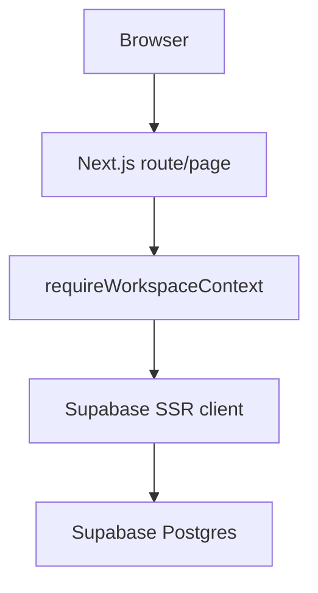
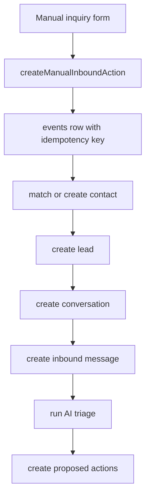
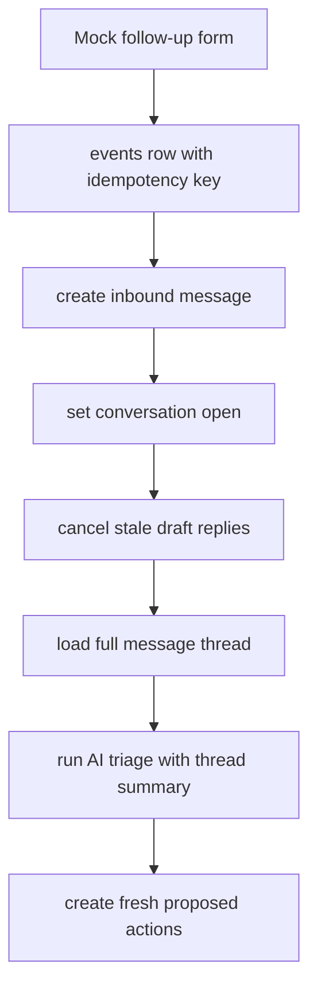

# Current Architecture

This document is the practical handoff guide for humans and AI agents working on Kyro.
It explains how the current code is structured, where data flows, and which pieces are
real versus intentionally stubbed.

## Project Shape

Kyro is a TypeScript monorepo.

- `apps/web`: Next.js App Router web app.
- `packages/db`: Drizzle schema and migration source.
- `packages/api`: backend domain helpers for actions, events, bootstrap, usage, and policies.
- `packages/ai`: model routing helper.
- `packages/contracts`: shared TypeScript/Zod contracts.
- `packages/core`: product constants.
- `packages/jobs`: workflow placeholder package.
- `supabase/migrations`: generated SQL migrations applied to Supabase.
- `docs`: product, architecture, database, and backlog notes.

## Runtime Stack

- Next.js App Router renders the web app.
- Supabase Auth handles sessions.
- Supabase Postgres is the source of truth.
- Drizzle owns schema/migration generation.
- Server Components read workspace data.
- Server Actions mutate data and then revalidate/redirect.
- Client Components are used only where local UI state improves UX, such as instant contact filters.

## Request Flow

The current web request pattern is:



Most routes call `requireWorkspaceContext()` before loading tenant data. This enforces:

- user must be signed in,
- user must have a bootstrapped workspace,
- all page data is loaded through the authenticated Supabase session.

Key file: `apps/web/src/lib/workspace/context.ts`.

## Data Ownership

All business data is workspace-scoped. The important tables are:

- `contacts`: CRM profiles.
- `leads`: sales/service opportunities attached to contacts.
- `channels`: communication source definitions.
- `integration_connections`: connected provider accounts such as Google Workspace,
  with encrypted token payloads and provider account metadata.
- `integration_oauth_states`: short-lived OAuth state and PKCE verifier records for
  provider connect flows.
- `conversations`: message threads.
- `messages`: inbound/outbound communication records.
- `inquiry_facts`: current editable inquiry facts for a conversation, separate from raw AI output.
- `events`: idempotent ingestion and workflow events.
- `actions`: proposed or executable work, including AI-proposed replies.
- `quote_drafts`: internal quote document placeholders created from approved actions.
- `assistant_threads`: persistent Assistant conversations per workspace/user.
- `assistant_messages`: saved Assistant/user turns, tool-call records, and UI block records.
- `assistant_memories`: explicit long-term Assistant memories for future retrieval.
- `ai_runs`: AI workflow records.
- `model_route_decisions`: model selection audit trail.
- `usage_events`: metered provider/API usage.
- `audit_logs`: append-only history of meaningful changes.

Schema source: `packages/db/src/schema.ts`.
Applied migrations: `supabase/migrations`.

## Auth And Workspace Bootstrap

Auth screens live in:

- `apps/web/src/app/sign-in/page.tsx`
- `apps/web/src/app/auth/actions.ts`
- `apps/web/src/app/auth/callback/route.ts`

Workspace creation lives in:

- `apps/web/src/app/onboarding/page.tsx`
- `apps/web/src/app/onboarding/actions.ts`
- `apps/web/src/lib/workspace/bootstrap.ts`

On account/workspace bootstrap, Kyro creates:

- user profile,
- workspace,
- owner membership,
- business profile,
- default policies,
- entitlements,
- budget,
- pricing rules.

## App Shell And Navigation

The shared logged-in shell is:

- `apps/web/src/app/components/app-frame.tsx`

Shared visual helpers:

- `apps/web/src/app/components/brand-mark.tsx`
- `apps/web/src/app/components/page-skeleton.tsx`
- `apps/web/src/app/components/route-preloader.tsx`

The shell also mounts a small client-side route preloader. After the browser is idle,
it staggers prefetches for the main logged-in routes so the high-traffic tabs feel
warmer without preloading every row/detail page.

On narrow mobile viewports, the shell hides the desktop sidebar, exposes the full
navigation through a drawer menu, and pins a bottom quick-nav for Assistant, CRM,
Inbox, and Settings. Topbar metrics collapse into compact right-aligned chips so
the emergency web UI remains usable on a phone.

Mobile detail surfaces intentionally do not use the desktop split-view pattern.
Assistant previews, Inbox message previews, and selected CRM profiles become
fixed full-screen task panels with their own scroll area and a close/back action,
similar to opening an email thread in a mobile mail app. Desktop keeps the
side-by-side split views.

The app shell currently exposes:

- Assistant: `/assistant`
- Voice: `/voice`
- Inbox: `/inbox`
- CRM: `/contacts`
- Documents: `/documents`
- Log: `/`
- Developer: `/developer`
- Settings: `/settings`

Legacy convenience routes:

- `/leads` redirects to `/contacts`.
- `/usage` redirects to `/settings#usage`.

## Current Screens

### Log

File: `apps/web/src/app/page.tsx`

Purpose:

- show a chronological workspace activity timeline,
- combine recent inbound/outbound messages, actions, events, audit logs, AI runs, model route decisions, and usage events,
- filter the timeline by all activity, messages, inbound, outbound, actions, events, audit, AI runs, routing, or usage,
- search the timeline by customer/message/action/model text, type/source/channel/model, detail/body text, and date range,
- show compact message/action/usage metrics,
- show a latest-activity summary and event-type breakdown.

The old dashboard concept has been collapsed into `Log`. Operational work now happens
primarily in Assistant, Inbox, CRM, Documents, and Settings.

### Developer

File: `apps/web/src/app/developer/page.tsx`

Purpose:

- hold internal test tools away from the main product surfaces,
- expose the mock inbound inquiry form for local testing,
- submit through the same `createManualInboundAction` and `ingestManualInbound` flow
  used by previous dashboard/manual testing,
- redirect back to `/developer` with success/error messages after ingestion.

The Developer page is not intended as an end-user surface. It is a convenient place
to keep test controls while Gmail, Drive, SMS, and other integrations are being wired.

### Inbox

Files:

- `apps/web/src/app/inbox/page.tsx`
- `apps/web/src/app/inbox/[conversationId]/page.tsx`

Purpose:

- list conversations,
- show profile-review warnings,
- open an inquiry review page,
- act as the main work queue for what needs attention next.

The inbox work queue derives buckets from conversation status, saved inquiry facts,
action status, and quote draft presence. Current buckets include needs reply,
missing info, ready to quote, site visit needed, awaiting customer, resolved,
needs review, and needs approval. The page also supports server-side search and
sorting without adding a separate search service.

Performance notes:

- the app shell uses Next link prefetching plus `RoutePreloader` to idle-prefetch
  the main tabs with a short stagger,
- list pages disable prefetch on long repeated rows so the app does not pre-render
  dozens of detail pages at once,
- list/review queries are bounded so mock data growth does not silently make every
  tab click heavier,
- inbox split-view loads the conversation list, selected preview, and communication
  settings in parallel once workspace context is resolved,
- route loading skeletons exist for the log, inbox, inquiry review, CRM, contact
  profile, leads redirect, documents, quote draft profile, assistant, usage redirect,
  and settings pages,
- the development LLM status pill caches its local Ollama health check briefly and is
  rendered behind a Suspense boundary so page content is not blocked by a local model probe.

The inquiry review page shows:

- compact contact profile summary,
- compact lead status,
- AI-extracted inquiry facts such as job type, address, preferred time, urgency, budget, lead suitability, and missing fields,
- editable current inquiry facts that can be corrected by the user,
- a regenerate control that uses the saved corrected facts as the authoritative source for a fresh AI plan,
- a collapsed AI transparency trace showing model, fallback, token usage, proposed action types, and raw debug JSON,
- message thread,
- text channel labels on message rows,
- outbound composer for email, SMS, phone, or manual notes,
- outbound metadata including channel type, dry-run/external-send state, provider message id, local attachment summaries, and quote draft attachment references,
- mock follow-up inbound message form,
- draft reply work surface,
- action-specific proposal cards for missing info, site visits, quote drafts, follow-ups, and not-fit decisions,
- saved quote draft placeholders when a quote draft action has been executed,
- latest AI triage summary,
- workflow timeline,
- editable draft replies before approval,
- proposed actions and approval/execution controls,
- conversation status controls,
- usage events collapsed by default,
- audit history collapsed by default.

Outbound email can send through the connected Gmail or Outlook account. Workspace communication
settings use `workspace_policies` with policy type `communication_outbound` once the
settings page has saved them, and fall back to strict defaults when that row does not
exist yet. User-written manual replies are treated as already approved because the
user typed the body and pressed send; email sends immediately through the connected
email provider when a
contact email exists. AI-generated/action-queue replies still go through the action
engine and approval/execution controls. SMS, phone, and manual channels are still
internal records until their providers are connected. Email sends can include local
file uploads from the composer and a generated text snapshot of a selected quote
draft; full Drive/PDF template attachments are still a later document-rendering step.
Email signatures are Kyro-managed per workspace: one default signature for manual or
user-edited sends, plus an optional assistant signature for untouched AI-generated
replies. Signature settings live inside the `communication_outbound` policy, support
text plus a small inline logo, and are applied during outbound execution rather than
relying on the user's native email signature.
Real Gmail/Outlook sends also write zero-cost `usage_events` rows so the billing endpoint can
count outbound email volume before paid pricing is decided.

### CRM

Files:

- `apps/web/src/app/contacts/page.tsx`
- `apps/web/src/app/contacts/[contactId]/page.tsx`
- `apps/web/src/app/contacts/actions.ts`
- `apps/web/src/app/leads/page.tsx`

Purpose:

- list contact profiles and leads in one CRM surface,
- keep the CRM list on the left and the selected profile on the right,
- filter by all, leads, clients, suppliers, contractors, builders, property managers, or other,
- search by name/company/job/contact details,
- expand advanced search fields for email, phone, and address,
- sort by last interacted, alphabetical, most messages, or most leads,
- keep active filters, search, sort, and selected profile in the URL so navigation and saves do not lose context,
- edit contact fields,
- show all linked conversations, leads, messages, AI runs, actions, audit history, and quote drafts linked to the contact.

`/leads` now redirects to `/contacts`; leads are a CRM filter rather than a separate primary tab.

Contact types currently supported:

- `client`
- `supplier`
- `contractor`
- `builder`
- `property_manager`
- `other`

Shared helper: `apps/web/src/lib/crm/contact-types.ts`.

### Documents

Files:

- `apps/web/src/app/documents/page.tsx`
- `apps/web/src/app/documents/[quoteDraftId]/page.tsx`
- `apps/web/src/app/documents/actions.ts`
- `apps/web/src/lib/documents/templates.ts`

Purpose:

- list saved quote drafts,
- filter quote drafts by all, draft, ready, sent, archived, linked, or unlinked,
- create standalone quote drafts from predefined templates,
- open and edit a quote draft,
- save customer/job details into `quote_drafts.metadata`,
- save editable line items into `quote_drafts.line_items`,
- apply predefined templates to an existing draft,
- hand a linked quote draft back to the inquiry outbound composer with that draft preselected,
- show linked CRM context, recent thread messages, and audit history when the draft came from an inquiry.

Quote drafts are internal saved documents only. They do not collect payment, create bookkeeping records,
or reconcile accounts. If a quote draft is linked to an inquiry, the outbound composer can attach a generated
text snapshot to a manual Gmail reply and mark the quote draft `sent` after the outbound message is recorded.
Full PDF rendering, Drive storage, and user template output are still future document steps.

### Assistant

Files:

- `apps/web/src/app/assistant/page.tsx`
- `apps/web/src/app/assistant/assistant-console.tsx`
- `apps/web/src/app/assistant/actions.ts`
- `apps/web/src/app/api/assistant/transcribe/route.ts`
- `apps/web/src/lib/assistant/commands.ts`
- `apps/web/src/lib/assistant/conversation-links.ts`
- `apps/web/src/lib/assistant/providers.ts`
- `apps/web/src/lib/assistant/engine.ts`
- `apps/web/src/lib/assistant/transcription.ts`

Purpose:

- provide a chat-style command layer over existing CRM data,
- persist Assistant threads and messages across page refreshes,
- store known UI blocks such as link cards instead of letting the LLM invent UI,
- store deterministic command results as tool-call records,
- retrieve a compact rolling thread summary and relevant explicit memories before each turn,
- route safe commands deterministically before involving a model,
- use local Ollama to narrate answers while preserving deterministic links/actions,
- accept browser-recorded voice notes, transcribe them server-side, and submit the transcript through the normal Assistant turn flow,
- record assistant turns as `ai_runs`, `model_route_decisions`, `usage_events`, and `audit_logs`,
- keep provider handling swappable for later cloud model APIs.

Current safe command families:

- work queue and leads needing reply,
- inquiry lookup by customer/job text, including exact and partial name matches,
- quote/document lookup and ready quote drafts,
- contact/customer summaries,
- standalone quote draft creation from predefined templates.
- explicit memory capture when the user says things like "remember..." or "for future...".
- general conversational turns that do not render CRM cards unless the user asks for CRM data.

Assistant writes are intentionally narrow. It can create internal quote drafts from templates, because that is a
document-only action and the user has explicitly instructed it in the prompt. From an Assistant inquiry preview, the
user can also write a manual reply; email replies send through connected Gmail and non-email channels are recorded
internally. The LLM does not autonomously send email/SMS, execute approval-gated actions, alter payments, or perform
bookkeeping.

Assistant memory layers currently implemented:

- active thread: `assistant_threads`,
- full saved turns: `assistant_messages`,
- rolling deterministic thread summary on the thread row,
- explicit long-term memories in `assistant_memories`,
- structured workspace truth loaded from CRM/document/usage tables as needed.

The LLM does not invent UI. It receives command results and optional thread/memory context, then writes short narration.
The frontend renders known `ui_blocks`, currently link cards and memory notices.

Assistant voice input uses the browser `MediaRecorder` API only for capture. Audio is posted to
`/api/assistant/transcribe`, where the server calls OpenAI's audio transcription endpoint with the configured
speech-to-text model and a Kyro-specific transcription prompt for product vocabulary and assistant-name variants.
The server also applies a small deterministic Kyro-name normalization pass after transcription so common address
forms such as "hey Cairo", "hi Kara", or "okay Kyra" become "Kyro" without changing unrelated uses of Cairo.
The OpenAI API key never goes to the browser. Successful transcriptions are metered into `usage_events` as
`speech_to_text_minutes` and audited as `assistant.voice_transcribed`; the resulting text is then submitted through
the normal Assistant turn flow with `inputSource=voice` so the model can treat terms like Cara/Kara/Cairo as likely
voice variants of Kyro when appropriate. In the composer, pressing the mic/stop control transcribes the audio back
into the draft box for editing, while pressing Send during recording transcribes and submits the voice note directly.

### Voice

Files:

- `apps/web/src/app/voice/page.tsx`
- `apps/web/src/app/voice/voice-console.tsx`
- `apps/web/src/app/api/assistant/transcribe/route.ts`
- `apps/web/src/app/api/assistant/speech/route.ts`
- `apps/web/src/lib/assistant/transcription.ts`
- `apps/web/src/lib/assistant/speech.ts`

Purpose:

- provide a separate voice-first test surface without crowding the main Assistant chat UI,
- reuse the same Assistant thread, command router, model provider, memory context, and CRM tools,
- transcribe each user voice turn with OpenAI speech-to-text,
- submit the transcript through the normal Assistant turn flow with `inputSource=voice`,
- synthesize each new Kyro response with OpenAI text-to-speech and play it back in the browser,
- meter speech-to-text minutes and estimated text-to-speech seconds in `usage_events`.

Voice mode is currently push-to-talk, post-response TTS. It is intentionally not a true realtime duplex voice agent
yet: there is no barge-in, partial assistant audio streaming, or interruption handling. Kyro normalizes the WAV
header returned by OpenAI before sending it to the browser, then plays the decoded audio through Web Audio so dev
playback speed can be enforced outside the normal media-element path. That keeps the product using one assistant
brain for now. A later mobile-ready implementation can swap the voice page onto OpenAI Realtime, VAPI, ElevenLabs,
or another realtime speech layer while still calling the same Kyro tools and permission boundaries.
Kyro treats `OPENAI_TTS_SPEED` values below `1` as a misconfiguration and falls back to the default fast voice speed,
so stale dev environment values cannot accidentally produce quarter-speed assistant audio.

Provider configuration:

```bash
ASSISTANT_PROVIDER=ollama
ASSISTANT_MODEL=qwen3:8b
ASSISTANT_OLLAMA_TIMEOUT_MS=60000
ASSISTANT_OLLAMA_NUM_PREDICT=180
ASSISTANT_OLLAMA_THINK=false
OPENAI_API_KEY=
OPENAI_STT_MODEL=gpt-4o-mini-transcribe
OPENAI_STT_PROMPT=
OPENAI_STT_UNIT_COST_PER_MINUTE_USD=0.003
OPENAI_STT_MARKUP_RATE=0.25
OPENAI_TTS_MODEL=tts-1
OPENAI_TTS_VOICE=alloy
OPENAI_TTS_FORMAT=wav
OPENAI_TTS_SPEED=2
OPENAI_TTS_INSTRUCTIONS=
OPENAI_TTS_UNIT_COST_PER_SECOND_USD=0
OPENAI_TTS_MARKUP_RATE=0.25
```

The provider abstraction lives in `apps/web/src/lib/assistant/providers.ts`. Future cloud providers should plug into
`runAssistantModel()` without changing the Assistant UI or deterministic command router.

### Settings And Usage

Files:

- `apps/web/src/app/usage/page.tsx`
- `apps/web/src/app/settings/page.tsx`
- `apps/web/src/app/settings/actions.ts`
- `apps/web/src/app/api/billing/usage/route.ts`
- `apps/web/src/lib/billing/usage-summary.ts`
- `apps/web/src/lib/communication/settings.ts`
- `apps/web/src/lib/usage/queries.ts`

Purpose:

- configure outbound approval mode,
- choose allowed channels for email, SMS, phone, or manual notes,
- save a default email signature and optional assistant signature,
- show Google Workspace and Microsoft Outlook readiness in one Integrations area,
- launch Google or Microsoft OAuth connect flows from that combined area,
- audit communication-setting changes,
- show provider/API cost and customer charge from the `usage_events` ledger,
- filter usage by today, 7 days, 30 days, or all time,
- break usage down by provider/model/service,
- break usage down by user,
- link ledger rows back to the most useful source where possible, such as an AI run's conversation, an action target, a contact, or a quote draft,
- expose read-only billable usage totals by monthly, weekly, or custom period through `/api/billing/usage`,
- show the current pricing posture without connecting payment collection.

Usage visibility is now incorporated into Settings. `/usage` redirects to
`/settings#usage`. The usage area is read-only. The billing endpoint is also read-only:
it sums stored `usage_events.customer_charge_snapshot` values by period and user so a
future payment system can consume the same ledger totals. It does not invoice, collect
payment, alter pricing rules, or push data to Stripe/Apple. It is a visibility layer
over the metering data that triage, Assistant, and future API integrations record.

Settings expose outbound policy and a combined Integrations area for Google Workspace
and Microsoft Outlook. Gmail and Outlook are the first real external send providers.
SMS, phone, and calendar remain future integrations.

## Manual Inquiry Ingestion

Files:

- `apps/web/src/app/inbound/actions.ts`
- `apps/web/src/lib/inbound/manual.ts`

Flow:



Important behavior:

- Manual/mock inquiry forms that call this action must include a one-time `submissionKey`.
- `manual.ts` writes the ingestion event first.
- Duplicate submissions with the same idempotency key are ignored.
- Contact matching is workspace-scoped.
- Exact email or phone matches attach to existing contacts.
- Email/phone conflicts create a new contact and mark the lead as high priority/profile check.
- Missing contact details can be filled on an existing matched profile.
- AI triage currently extracts simple inquiry facts, normalizes generic model labels like "new inquiry from John" back to trade-specific job types where possible, saves the current fact row, proposes one or more actions, and marks the conversation as `reply_drafted` once proposals exist.
- If the user edits the saved inquiry facts and regenerates the plan, Kyro cancels stale pending/approved proposal actions for that conversation plus any stale lead-level `mark_not_fit` proposal, audits the cancellation, and reruns triage with the corrected facts locked as authoritative input.

## Mock Follow-Up Ingestion

Files:

- `apps/web/src/app/inbox/actions.ts`
- `apps/web/src/lib/inbound/follow-up.ts`

The inquiry review page can add a mock inbound follow-up to an existing thread.
This is the current way to test a multi-message conversation before Gmail inbound
sync and SMS inbound channels exist.

Flow:



Important behavior:

- resolved conversations reopen when a new inbound follow-up is recorded,
- stale `pending_approval` or `approved` thread actions are cancelled,
- completed dry-run outbound messages are preserved,
- the next AI triage run receives a short full-thread summary,
- no external communication is sent.

## CRM Query Layer

File: `apps/web/src/lib/crm/queries.ts`

This file centralizes read models used by the UI:

- `getContactList`
- `getContactProfile`
- `getLeadList`
- `getConversationList`
- `getConversationReview`
- `getQuoteDraftList`
- `getQuoteDraftProfile`

If adding a screen that needs CRM data, prefer adding or extending a read helper here instead of scattering Supabase queries across many pages.

## Event, Action, Audit Engine

Files:

- `apps/web/src/lib/engine/event-action-audit.ts`
- `apps/web/src/app/engine/actions.ts`
- `packages/api/src/services/action.service.ts`
- `packages/api/src/services/event.service.ts`

Pattern:

- events represent something that happened or needs processing,
- actions represent proposed or executable side effects,
- audit logs record meaningful changes and transitions.

Current action behavior:

- `draft_reply` is the primary reply-planning action for every inbound inquiry,
- missing information is stored in `inquiry_facts.missing_info` and folded into the `draft_reply` body rather than proposed as a separate `ask_missing_info` action,
- `draft_reply` actions can be edited and sent from the inquiry review page, Inbox split preview, or Assistant preview,
- pressing `Send generated reply` is the approval for generated replies; it saves any visible draft edits and then executes the send/record action,
- Assistant inquiry previews include a manual reply composer so the user can respond even when no AI draft action exists,
- user-written manual reply composers send or record immediately because the button press is the explicit approval,
- pending draft replies can be edited from the inquiry review page before approval,
- executing a `draft_reply` sends through Gmail when the channel is email and the contact has an email address,
- executing non-email channels records an internal outbound `messages` row until SMS/phone providers exist,
- outbound message metadata records `dryRun`, `externalSend`, `provider`, `sentTo`, attachments, and any external provider message id,
- `create_quote_draft` actions create internal `quote_drafts` rows only,
- quote drafts created from inquiry actions prefill customer/job metadata from the linked contact, lead, and saved inquiry facts,
- `book_site_visit` completes as an internal dry-run plan,
- follow-up reminders are intentionally not shown as immediate approval actions; they should become due-state reminders driven by a workspace follow-up delay setting,
- `mark_not_fit` updates the attached lead status to `not_fit`,
- SMS/phone/calendar are still not connected.

This is intentional. Gmail is the first real outbound provider; the same action-executor seam should be reused for
SMS, phone, calendar, and Drive/PDF document generation later.

Conversation statuses currently used by the review workflow:

- `open`: inbound conversation exists and needs work.
- `reply_drafted`: AI has proposed a reply.
- `replied`: an outbound reply has been sent externally or recorded internally in the thread.
- `resolved`: user manually marked the conversation resolved.

The inbox list derives a `nextActionLabel` from conversation status, latest
message direction, lead priority, and pending/approved actions. This keeps the
list focused on what the operator should do next, rather than only showing raw
database statuses.

## AI And Usage

Files:

- `apps/web/src/lib/ai/triage.ts`
- `apps/web/src/app/ai/actions.ts`
- `packages/ai/src/index.ts`

Current AI supports two development modes:

- `AI_PROVIDER=stub`: deterministic no-network triage.
- `AI_PROVIDER=ollama`: local Ollama triage, currently configured for `qwen3:8b`.

Both modes preserve the same Kyro workflow shape:

- Kyro still records realistic `ai_runs`,
- model route decisions are recorded,
- usage events are recorded,
- deterministic inquiry facts are extracted from the mock inbound text and thread context,
- multiple action proposals can be created from the facts.

When Ollama mode is enabled, `apps/web/src/lib/ai/triage.ts` calls the local
Ollama `/api/chat` endpoint and asks for compact JSON containing inquiry facts
and a reply draft. If Ollama is unavailable, malformed, or mid-upgrade, Kyro
falls back to the deterministic stub and records the fallback reason in the
AI run output. Local Ollama usage is metered with estimated/token counts and
zero provider cost while testing.

Relevant environment variables:

```bash
AI_PROVIDER=ollama
OLLAMA_BASE_URL=http://127.0.0.1:11434
OLLAMA_MODEL=qwen3:8b
OLLAMA_TIMEOUT_MS=60000
OLLAMA_NUM_PREDICT=320
OLLAMA_THINK=false
```

This lets the app prove the workflow shape before real model calls are added.

For local qwen-style thinking models, Kyro disables Ollama thinking mode by default
on Assistant narration and inquiry triage. The app needs short operational answers
and compact JSON, not long hidden reasoning traces. This keeps local testing snappy
and avoids timeout fallbacks while preserving the same provider abstraction for
future cloud APIs.

The Assistant uses the same general model-routing idea, but its provider layer is separate from triage so chat/command
behavior can be upgraded independently. It defaults to local Ollama for development through `ASSISTANT_PROVIDER`.

## Performance Pattern

Current performance approach:

- routes are server-rendered for fresh authenticated data,
- high-value nav links use Next prefetching,
- `RoutePreloader` idle-prefetches core logged-in tabs with a stagger so navigation
  is warm without hammering every detail route,
- long repeated list rows intentionally keep `prefetch={false}`,
- list/detail pages have skeleton loading states,
- CRM filter/search/sort state is URL-backed and rendered server-side so the split profile panel can preserve context across clicks and saves,
- inbox split-view fetches the list, selected preview, and communication settings in parallel after workspace resolution,
- log data, engine queues, and AI ledger data are fetched in parallel after workspace resolution,
- log counts are workspace-scoped,
- the Assistant landing page uses count queries where possible and reuses the bounded
  conversation list for workflow counts that need bucket logic.

Do not preload everything. The current reasonable preload set is:

- main app routes: Assistant, Voice, Inbox, CRM, Documents, Log, Settings,
- already-open split-view records,
- compact list summaries and counts for the active screen.

Heavy data should remain on demand:

- full audit logs,
- full usage history,
- old message threads,
- attachments,
- generated documents,
- AI run history beyond recent summaries.

## Branding

Current temporary logo asset:

- `apps/web/public/kyro-icon.png`
- `apps/web/src/app/icon.png`

UI component:

- `apps/web/src/app/components/brand-mark.tsx`

When replacing the logo later, update the image assets and `brand-mark.tsx` if needed.

## Where To Add Common Features

Use this map before editing:

- New CRM list/read data: `apps/web/src/lib/crm/queries.ts`
- New contact type label: `apps/web/src/lib/crm/contact-types.ts`
- New contact mutation: `apps/web/src/app/contacts/actions.ts`
- New manual inquiry behavior: `apps/web/src/lib/inbound/manual.ts`
- New developer/test tool screen: `apps/web/src/app/developer/page.tsx`
- New action transition/execution behavior: `apps/web/src/lib/engine/event-action-audit.ts`
- New AI triage behavior: `apps/web/src/lib/ai/triage.ts`
- New inquiry fact editing behavior: `apps/web/src/app/inbox/actions.ts`
- New quote draft read behavior: `apps/web/src/lib/crm/queries.ts`
- New quote draft editor/template behavior: `apps/web/src/app/documents/actions.ts`, `apps/web/src/lib/documents/templates.ts`
- New quote draft action-execution behavior: `apps/web/src/lib/engine/event-action-audit.ts`
- New assistant command behavior: `apps/web/src/lib/assistant/commands.ts`
- New assistant model provider: `apps/web/src/lib/assistant/providers.ts`
- New assistant persistence/memory behavior: `apps/web/src/lib/assistant/persistence.ts`
- New assistant UI block behavior: `apps/web/src/lib/assistant/ui-blocks.ts`
- New assistant speech-to-text behavior: `apps/web/src/app/api/assistant/transcribe/route.ts`
  and `apps/web/src/lib/assistant/transcription.ts`
- New assistant text-to-speech behavior: `apps/web/src/app/api/assistant/speech/route.ts`
  and `apps/web/src/lib/assistant/speech.ts`
- New voice-first UI behavior: `apps/web/src/app/voice/page.tsx`
  and `apps/web/src/app/voice/voice-console.tsx`
- New Google OAuth connection behavior: `apps/web/src/app/integrations/google/start/route.ts`,
  `apps/web/src/app/integrations/google/callback/route.ts`, and `apps/web/src/lib/integrations/google.ts`
- New Microsoft OAuth connection behavior: `apps/web/src/app/integrations/microsoft/start/route.ts`,
  `apps/web/src/app/integrations/microsoft/callback/route.ts`, and `apps/web/src/lib/integrations/microsoft.ts`
- New Gmail/Outlook send behavior: `apps/web/src/lib/integrations/gmail.ts`,
  `apps/web/src/lib/integrations/outlook.ts`, `apps/web/src/lib/integrations/mail.ts`,
  `apps/web/src/lib/communication/outbound.ts`, and `apps/web/src/lib/communication/signatures.ts`
- New provider token encryption behavior: `apps/web/src/lib/integrations/token-vault.ts`
- New usage/billing read behavior: `apps/web/src/lib/usage/queries.ts`, surfaced from Settings
- New schema field/table: `packages/db/src/schema.ts`, then generate a migration.
- New route loading state: add `loading.tsx` beside the route.
- Shared layout/nav: `apps/web/src/app/components/app-frame.tsx`
- Core route preloading: `apps/web/src/app/components/route-preloader.tsx`
- Visual styling: `apps/web/src/app/globals.css`

## Current Intentional Gaps

These are not bugs:

- Gmail and Outlook OAuth plus real outbound email are connected for approved/user-triggered sends.
- Gmail inbound sync is not connected yet.
- Outlook inbound sync is not connected yet.
- SMS is not connected yet.
- AI triage and Assistant narration can use local Ollama in development, but cloud LLM providers are not wired yet.
- Voice mode uses OpenAI text-to-speech as a post-response playback layer. It is not true realtime speech-to-speech yet.
- Action execution can send real Gmail/Outlook email. Non-email side effects are still dry-run/internal.
- Gmail/Outlook can send uploaded local file attachments and generated text snapshots of selected quote drafts.
- Full PDF/invoice rendering from user-uploaded templates is not implemented yet. Current quote drafts are saved editable internal documents only.
- Assistant chat is implemented as a persisted safe command/tool layer, not a free-roaming autonomous agent.
- Assistant long-term memory only saves explicit user memory instructions for now; automatic inferred memory is intentionally not active yet.
- Usage visibility exists in Settings, but payments, payment-provider billing, bookkeeping, reconciliation, and tax are intentionally out of scope.
- Address input is plain text for now. The backlog notes future Google address verification.

## Verification Commands

Run these after meaningful changes:

```bash
npm run typecheck
npm run lint
npm run db:check
npm run build
```

When schema changes are made:

```bash
npm run db:generate -- --name descriptive_name
npm run db:migrate
npm run db:check
```

## Security Notes

- Never expose Supabase service-role keys in browser code.
- Only `NEXT_PUBLIC_*` variables are safe for client-side exposure.
- Keep writes in Server Actions or backend service helpers.
- Preserve workspace scoping on every query.
- Add audit logs for meaningful user, AI, or system changes.
- Keep outbound side effects behind the action engine and workspace policies.
