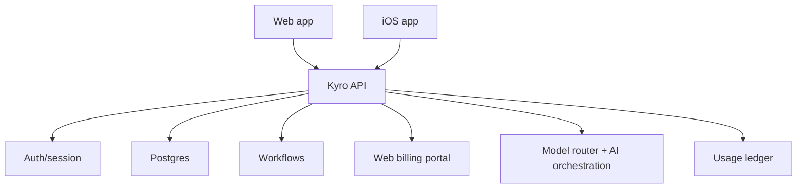

# Platform Strategy

This is a target architecture note. For what is implemented right now, use
`docs/current-architecture.md`.

## Product Goal

Kyro should be available as both:

- A web app for full account management, billing, setup, dashboards, and daily work.
- An iOS app for native mobile workflows and the same core business data/actions.

Both clients must use the same backend, tenant model, permissions, action system, model
router, and usage ledger.

## Architecture Principle

Kyro is API-first.

The web app and iOS app are clients. They do not own business logic, billing logic,
approval rules, model routing, usage metering, or action execution.

## Client Responsibilities

### Web App

The web app should be the complete management surface:

- Sign up and onboarding.
- Workspace setup.
- Business profile and knowledge base.
- Integrations setup.
- Inbox, leads, contacts, tasks, documents, and assistant chat.
- Usage dashboard.
- Billing account management.
- Plan management.
- Admin controls and policies.

### iOS App

The iOS app should feel native and fast, but use the same backend capabilities:

- Inbox and lead triage.
- Assistant chat.
- Contact/lead lookup.
- Push notifications.
- Voice input later.
- Camera/photo upload for image/document workflows.
- Review/approve/send actions.
- Generated document/image access.
- Usage visibility where allowed.

iOS should not need separate business logic. If a feature exists in both clients, the
backend endpoint and action system should be shared.

## Shared Contracts

Use shared API contracts and validation schemas wherever possible.

Recommended monorepo shape:

- `apps/web`
- `apps/ios`
- `packages/api`
- `packages/db`
- `packages/contracts`
- `packages/core`
- `packages/jobs`
- `packages/ai`

The web app can share TypeScript contracts directly. The iOS app should consume generated
or documented API contracts so it is not guessing payload shapes.

## Billing Strategy

Billing should be web-first.

The backend should own:

- Billing accounts.
- Plan state.
- Usage ledger.
- Usage rollups.
- Usage-based charges and margin rules.
- Entitlements.
- Invoices from the payment provider.
- Workspace access decisions.

The web app should own:

- Checkout.
- Billing portal access.
- Payment method updates.
- Plan changes.
- Usage and invoice views.

The iOS app should not attempt to represent Kyro's metered usage model with a single
one-size-fits-all App Store subscription.

The iOS app should read entitlement state from the backend and avoid implementing payment
logic unless App Store policy or launch strategy requires it.

## Apple App Store Posture

Apple payment rules are a launch risk and must be handled deliberately.

Current Apple App Review guidance says apps that unlock digital features or functionality
inside the app generally must use in-app purchase unless an exception or permitted external
purchase path applies. Apple also lists a free companion app path for paid web-based tools,
provided there is no purchasing inside the app and no calls to action for purchase outside
the app.

Recommended Kyro posture until reviewed by counsel/App Review:

- Web handles signup, checkout, billing, invoices, and plan changes.
- iOS is free to download.
- iOS allows existing users to sign in and use their workspace.
- iOS does not include checkout UI.
- iOS does not include pricing pages or upgrade CTAs unless an approved entitlement/region
  strategy is in place.
- Backend entitlements decide what a workspace can access.

This keeps the architecture flexible whether Kyro launches as web-first, iOS companion, or
with a later App Store-compliant purchase path.

## Entitlements

Entitlements are separate from billing events.

The app should check backend entitlements such as:

- `can_use_ai_chat`
- `can_auto_send_email`
- `can_auto_send_sms`
- `can_generate_documents`
- `can_generate_images`
- `monthly_usage_limit`
- `allowed_model_tiers`

Billing creates or changes entitlements. Clients only consume them.

## First Build Implication

Build the backend and web app first, then add iOS.

Reason:

- Web is needed for billing and admin.
- Backend contracts need to stabilize before native work.
- Usage metering must work before billing.
- iOS becomes much easier once core endpoints exist.

## Near-Term iOS Readiness

The web UI is still the fastest place to prove product behavior, but new work should avoid
making the web shell the product boundary.

Default implementation posture:

- Keep assistant orchestration, CRM actions, permissions, model routing, usage metering, and
  realtime voice session creation in server/lib modules that can later sit behind API routes.
- Treat React screens as clients of those modules, not the owners of business behavior.
- Prefer explicit request/response shapes for new actions so they can become generated iOS
  contracts later.
- Keep realtime voice sharing the Assistant thread, memory, tools, permissions, and transcript
  persistence; native iOS should replace browser audio plumbing, not fork the assistant brain.
- Keep pronunciation vocabulary and outbound voice strictness as backend/workspace policy so iOS
  can use the same approved/suggested terms, lightweight usage ranking, and customer-facing
  safety gates.
- Keep inbound email sync, action filtering, quiet-hours polling, and manual/assistant-triggered
  inbox checks in backend modules/routes so iOS can call the same contracts rather than owning
  mailbox provider logic.
- Avoid browser-only assumptions in shared libraries. Browser APIs belong in web components or
  web-specific route handlers.
