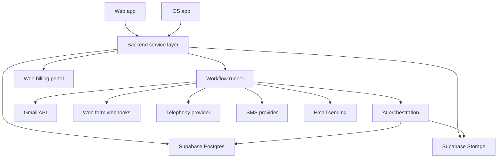

# Kyro V1 Foundation

This is the product/architecture target for V1. It intentionally includes planned
capabilities that are not yet implemented. For the current codebase state, use
`docs/current-architecture.md`.

## Product Interpretation

Kyro V1 is a context-aware inbound and outbound business assistant for sole traders.
It is not a generic assistant platform. The core system manages business communication,
lead handling, business knowledge, document generation, and auditable AI actions.

The chat interface is the control surface. The backend is the product.

## V1 Product Boundaries

### Core

- Gmail-first inbound email ingestion.
- Website/web form/webhook lead ingestion.
- Narrow overflow phone capture.
- Contacts, leads, conversations, messages, and tasks.
- Workspace-scoped business profile and knowledge base.
- AI assistant chat over workspace context.
- Action system for drafting, sending, updating, creating, and generating artifacts.
- Workspace-configurable approval rules for outbound email and SMS.
- Template-driven document generation and file saving.
- Image generation/editing as an attached AI/file capability.
- Audit logs for all meaningful system and AI actions.

### Explicitly Not V1

- Full accounting, bookkeeping, reconciliation, tax, or payment processing.
- Full call center routing.
- Broad social inbox support.
- Browser/computer-use automation as a product pillar.
- General-purpose automation marketplace.

## Recommended Architecture

## Backend Components

### API Layer

The API layer owns authentication, workspace membership checks, validation, business logic,
and action execution. The frontend should never directly perform sensitive business actions.
Both the web app and iOS app must use this same backend layer.

### Data Layer

Postgres is the source of truth. All business memory lives in structured tables and
workspace-scoped knowledge chunks, not implicit model memory.

### Event Layer

Every inbound or user-triggered change becomes an event. Events are idempotent,
workspace-scoped, and processed by background workflows.

Examples:

- `inbound.email.received`
- `inbound.web_form.received`
- `inbound.call.completed`
- `chat.message.received`
- `action.requested`
- `document.generation.requested`
- `media.generation.requested`

### Action Layer

Actions are the bridge between AI suggestions and real side effects.

Examples:

- Send email.
- Send SMS.
- Draft reply.
- Create task.
- Update lead.
- Generate document.
- Attach file to outbound message.
- Generate or edit image.

Actions may execute immediately or require approval depending on workspace policy.
Actions should carry estimated and actual usage/cost references where relevant, so a user
can understand what the assistant spent to complete a piece of work.

### AI Orchestration Layer

The AI layer should be stateless with respect to trust. It can reason, retrieve, summarize,
classify, extract, draft, and propose tool calls. The backend decides whether a tool call is
permitted and records the result.

Primary orchestration modes:

- Inbound triage.
- Chat assistant.
- Document generation.
- Image generation/editing.
- Outbound drafting/sending.

AI calls must go through a model router instead of hard-coded model selections.
Kyro should feel like one always-on assistant, while the backend routes simple tasks to
cheap/fast models and complex or risky work to stronger models.

Model routing inputs should include:

- Task type.
- Workspace policy.
- User and workspace budget state.
- Risk level.
- Required capabilities.
- Latency target.
- Context size.
- Fallback rules.

Every AI/provider call must create usage records suitable for per-workspace and per-user
metering.

## Recommended Stack

### Application

- Next.js App Router.
- Native iOS app after the web/API foundation is stable.
- TypeScript.
- Tailwind CSS.
- Radix/shadcn-style component primitives.
- Shared API contracts for web and iOS clients.

### Backend

- TypeScript service modules in the same monorepo for V1.
- API route handlers or a dedicated server package if the app grows.
- Zod for input validation.
- Drizzle ORM for schema and migrations.

### Database and Storage

- Supabase Postgres.
- Supabase Auth unless a strong reason emerges for Clerk.
- Supabase Storage for uploads, generated documents, call recordings, and generated images.
- `pgvector` for workspace-scoped retrieval.

### Jobs

- Trigger.dev for V1 workflow execution and visibility.
- Idempotency keys on all ingestion events.

### AI

- OpenAI Responses API for orchestration and tool calling.
- Structured outputs for classification, extraction, and document field generation.
- Embeddings stored in `knowledge_chunks`.
- Model router for task-specific provider/model selection.
- Append-only usage metering for tokens, API calls, images, SMS, voice, documents, and storage.

### Integrations

- Gmail OAuth and Gmail API push notifications first.
- Website/webhook ingestion second.
- Twilio Voice for overflow call capture.
- SMS via Twilio, gated by workspace policy and compliance state.
- Microsoft Outlook/Graph after Gmail proves the loop.

## Integration Strategy

### Gmail

Start with read/triage/draft/send scopes only as needed. Store external message ids,
thread ids, history ids, and sync cursors. Process push notifications into internal events.

### Web Forms

Provide authenticated workspace webhook endpoints and embeddable form endpoints later.
Normalize all submissions into contact, lead, conversation, message, and event records.

### Overflow Calls

Keep V1 narrow:

- Answer only according to user rules.
- Capture caller name, phone, intent, urgency, and callback preference.
- Store transcript and summary.
- Create or update contact/lead/task.

### Outbound Email and SMS

Outbound communications always flow through actions and policy checks.
The user can allow autonomous sends, but the backend must still enforce eligibility,
rate limits, consent where required, quiet hours, blocked recipients, and audit logging.

### Documents

Document creation is user-instructed and template-driven.
Kyro creates and saves documents, including invoice-like documents, but does not manage
payments, bookkeeping, reconciliation, or tax.

### Images

Image generation and editing are file-backed AI artifact actions.
Generated media can be attached to outbound communication through the normal action system.

## Web and iOS Strategy

Kyro should be API-first with two clients:

- Web app: full management surface, setup, billing, dashboards, and daily work.
- iOS app: native mobile workflows over the same workspace data and action system.

The backend owns billing state, usage metering, entitlements, policies, action execution,
and model routing. Clients only present and request capabilities.

Billing should be web-first. The iOS app should read backend entitlements and avoid checkout,
pricing, or upgrade flows unless the App Store policy strategy explicitly supports them.

## Approval and Autonomy Model

Each workspace has communication policies:

- `require_approval`: AI may draft but not send without approval.
- `auto_send_trusted`: AI may send to eligible existing contacts/leads.
- `auto_send_all_eligible`: AI may send where channel and compliance checks pass.

Policies can be channel-specific:

- Email.
- SMS.
- Future channels.

The action engine should support:

- Approval queues.
- Manual overrides.
- Workspace kill switch.
- Per-action audit trail.
- Policy snapshots on executed actions.
